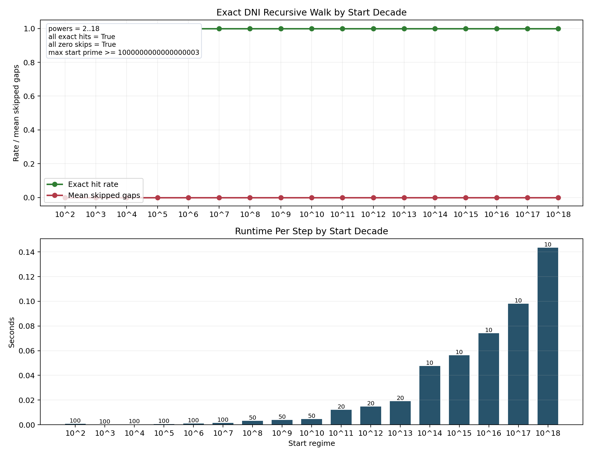

## Exact Recursive Prime Walk

The most jarring combined predictor result in the repository is this: once the
implemented score maximizer appears inside a prime gap, the next prime arrives before
any later interior composite with strictly smaller divisor count can appear.
That closure law is what lets the unbounded DNI/GWR walker recover the next
prime exactly from the ordered divisor structure of the next-gap interior.

Given a known prime `p`, the exact divisor-count theorem determines the next
prime `q` directly: scan integers greater than `p` in increasing order, compute
`tau(n)` exactly, and stop at the first integer with `tau(n) = 2`. The recursive
walk uses that exact `p -> q` step as its successor-prime transition. No cutoff
theorem is involved.

On the current verified surface, that mechanism supports an exact deterministic
no-skip sequential walk. The transition rule is exact on `743,075 / 743,075`
rows from the combined $10^6 + 10^7$ next-gap surface, and the recursive walk
records `664,578 / 664,578` exact consecutive next-prime recoveries from prime
`11` through prime `10,000,121` with `0` skipped gaps. The sampled decade
ladder from $10^2$ through $10^18$ also stayed at exact hit rate `1.0` with
`0` skipped gaps across `860` measured recursive steps.

The predictor note is documented in
[docs/research/predictor/gwr_dni_exact_recursive_prime_walk_note.md](docs/research/predictor/gwr_dni_exact_recursive_prime_walk_note.md),
and the live implementation is
[benchmarks/python/predictor/gwr_dni_recursive_walk.py](benchmarks/python/predictor/gwr_dni_recursive_walk.py).

## Dynamic Cutoff and Square-Branch Falsification

The old fixed cutoff theorem `{2:44, 4:60, 6:60}` is false. It fails at
`q = 24,098,209`, where the square branch gives `E(q) = 72 > 60`. The bounded
walker in the repo no longer treats that fixed map as live.

The current bounded compression is empirical:
`C(q) = max(64, ceil(0.5 * log(q)^2))`. Through the direct square-branch audit
at `p <= 10^6`, the repo tested `78,498` prime squares, found `7,477`
violations of the old fixed map, and observed maximum square offset `246`.
The compare mode in the recursive walker is the live falsification instrument:
it runs the bounded and unbounded walkers in lockstep and records any bounded
miss immediately.

See
[benchmarks/python/predictor/square_branch_gap_audit.py](benchmarks/python/predictor/square_branch_gap_audit.py),
[benchmarks/python/predictor/gwr_dni_recursive_walk.py](benchmarks/python/predictor/gwr_dni_recursive_walk.py),
and
[docs/research/predictor/gwr_dni_exact_recursive_prime_walk_note.md](docs/research/predictor/gwr_dni_exact_recursive_prime_walk_note.md).

## No-Later-Simpler-Composite

The strongest closure consequence currently documented in the repository is
this: once the implemented score maximizer appears inside a prime gap, the next prime
arrives before any later interior composite with strictly smaller divisor
count can appear.

This is the closure law behind the exact recursive walk. After the selected integer
appears, the gap interior does not later produce a simpler composite before
the next prime closes the interval.

In symbols, if $w$ is the implemented log-score maximizer in the gap $(p, q)$ and

$$
T_{<}(w) = \min \{\, n > w : d(n) < d(w) \,\},
$$

then the closure condition is

$$
q \le T_{<}(w).
$$

This is an exact corollary of the proved GWR theorem. The separate
question is whether it can stand on its own as a direct prime-gap theorem without
using GWR as the parent result. The current documented surface includes a
deterministic even-band ladder at every decade from $10^8$ through $10^{18}$
with zero observed violations.

See
[PROOF.md](PROOF.md),
[gwr/findings/closure_constraint_findings.md](gwr/findings/closure_constraint_findings.md),
and
[docs/current_headline_results.md](docs/current_headline_results.md).

## Dominant d=4 Reduction

In the dominant selected-integer regime, the tested gaps admit no interior prime square,
and the implemented score maximizer is exactly the first interior integer with
$d(n)=4$.

That gives the leading regime a visible mechanism: square exclusion first,
then first-`d=4` arrival. The stricter semiprime-only slogan is false; a thin
prime-cube exception family survives inside the broader `d=4` class.

See
[gwr/findings/dominant_d4_arrival_reduction_findings.md](gwr/findings/dominant_d4_arrival_reduction_findings.md)
and
[docs/current_headline_results.md](docs/current_headline_results.md).

