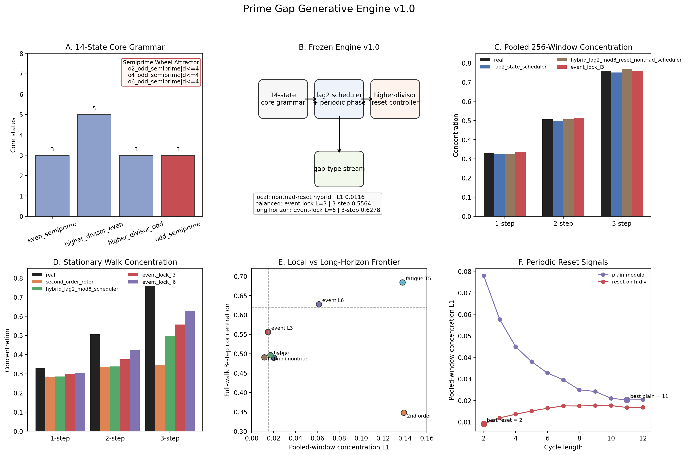

# Prime Gap Generative Model v1.0

Prime Gap Generative Model v1.0 is the frozen reference release for the
hierarchical reduced gap-type model.

This release packages the first deterministic model family in the repository
that closes the local reduced prime-gap type surface to pooled-window
concentration L1 `0.0116` while also exposing a measured long-horizon reset
target.

## Headline Freeze Metrics

- local fidelity profile:
  `hybrid_lag2_mod8_reset_nontriad_scheduler`
  with pooled-window concentration L1 `0.0116`
- balanced operating profile profile:
  event-lock `L = 3`
  with pooled-window concentration L1 `0.0150`
  and full-walk three-step concentration `0.5564`
- long-horizon study profile:
  event-lock `L = 6`
  with full-walk three-step concentration `0.6278`

## Named Model Objects

- persistent `14`-state core grammar
- Semiprime Wheel Attractor:
  `o2_odd_semiprime|d<=4`,
  `o4_odd_semiprime|d<=4`,
  `o6_odd_semiprime|d<=4`
- lag-2 transition rule plus periodic state
- higher-divisor-triggered long-horizon reset controller

## Release Artifacts

### Frozen synthesis

- [../../research/03-gap-types/output/gwr_dni_gap_type_engine_v1_summary.json](../../research/03-gap-types/output/gwr_dni_gap_type_engine_v1_summary.json)
- 

### Model code and tests

- [../../research/03-gap-types/scripts/gwr_dni_gap_type_engine_synthesis.py](../../research/03-gap-types/scripts/gwr_dni_gap_type_engine_synthesis.py)
- [../../research/03-gap-types/tests/test_gwr_dni_gap_type_engine_synthesis.py](../../research/03-gap-types/tests/test_gwr_dni_gap_type_engine_synthesis.py)

### Freeze note and rulebook

- [../../research/03-gap-types/docs/gap_type_engine_v1_freeze.md](../../research/03-gap-types/docs/gap_type_engine_v1_freeze.md)
- [../../research/03-gap-types/docs/gap_type_engine_v1_rulebook.md](../../research/03-gap-types/docs/gap_type_engine_v1_rulebook.md)

### Submission draft

- [../../research/02-gwr-dni/docs/prime_gap_hierarchical_engine_paper_draft.md](../../research/02-gwr-dni/docs/prime_gap_hierarchical_engine_paper_draft.md)

### Synthetic example

- [../../research/03-gap-types/output/gwr_dni_gap_type_generative_probe_synthetic.csv](../../research/03-gap-types/output/gwr_dni_gap_type_generative_probe_synthetic.csv)

The synthetic example contains `10,000` committed rows on the persistent core
surface. The first row and the last row are both
`o4_odd_semiprime|d<=4`, which makes the attractor visible immediately even in
the bare CSV.

## Validation

The release state is backed by the predictor slice:

```bash
pytest -q \
  research/03-gap-types/tests/test_gwr_dni_gap_type_sequence_probe.py \
  research/03-gap-types/tests/test_gwr_dni_gap_type_generative_probe.py \
  research/03-gap-types/tests/test_gwr_dni_gap_type_engine_decode.py \
  research/03-gap-types/tests/test_gwr_dni_gap_type_scheduler_probe.py \
  research/03-gap-types/tests/test_gwr_dni_gap_type_hybrid_scheduler_probe.py \
  research/03-gap-types/tests/test_gwr_dni_gap_type_long_horizon_controller_probe.py \
  research/03-gap-types/tests/test_gwr_dni_gap_type_engine_synthesis.py
```

## Scope

This release is a claim about reduced prime-gap types, not yet a theorem about
the full raw gap-size sequence.

The current supported statement is:

On the persistent reduced gap-type surface, prime-gap types are generated by a
hierarchical finite-state model with a `14`-state core grammar, a transition rule
layer, and a higher-divisor-triggered long-horizon controller.

The current research target remains explicit:

No single tested deterministic controller yet achieves both pooled-window
concentration L1 below `0.015` and full-walk three-step concentration above
`0.62`.
