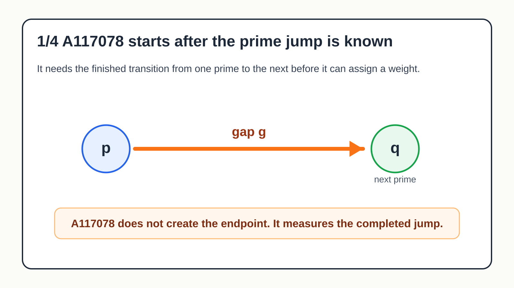
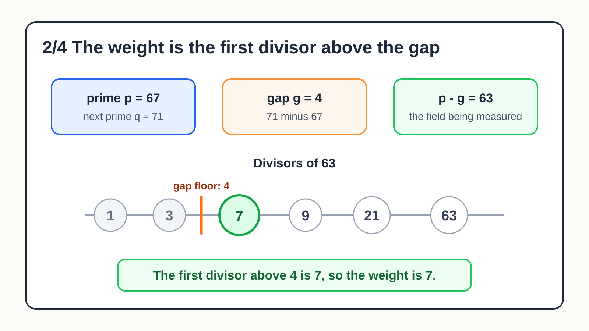
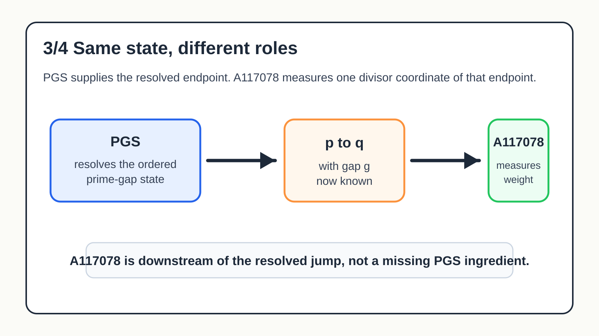
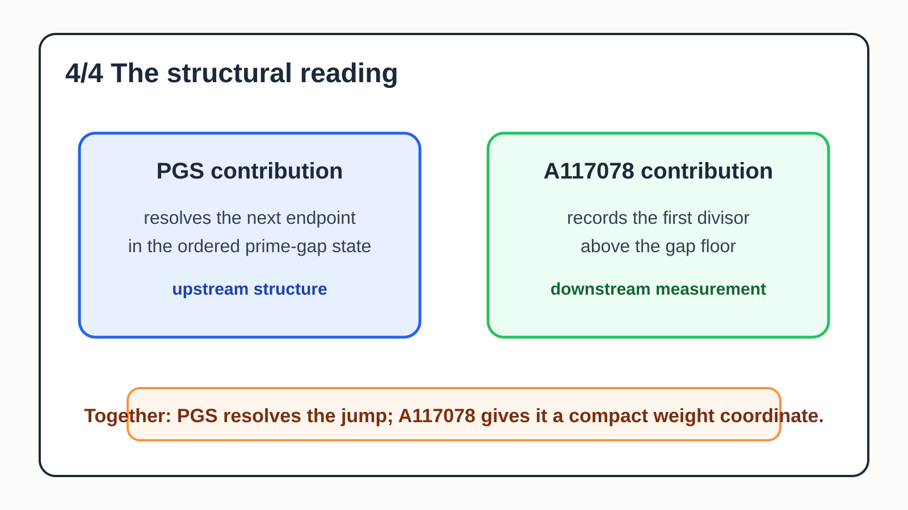

@decompwlj Your A117078 reads naturally in PGS as a ruler on a completed prime jump. Given prime p, next prime q, and gap g, it finds the first divisor above g of p-g. PGS supplies the upstream structure A117078 assumes: resolving q. Then A117078 measures the resolved gap.

