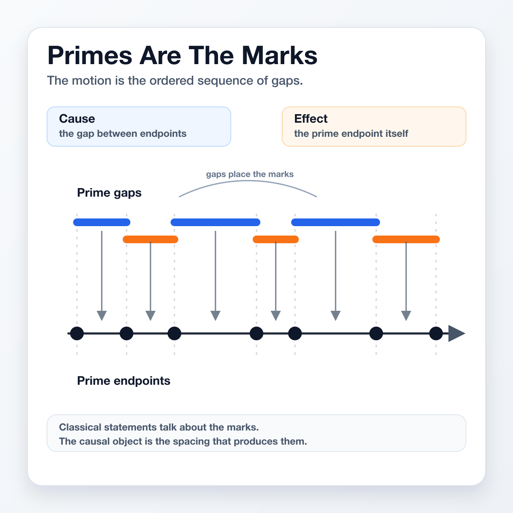
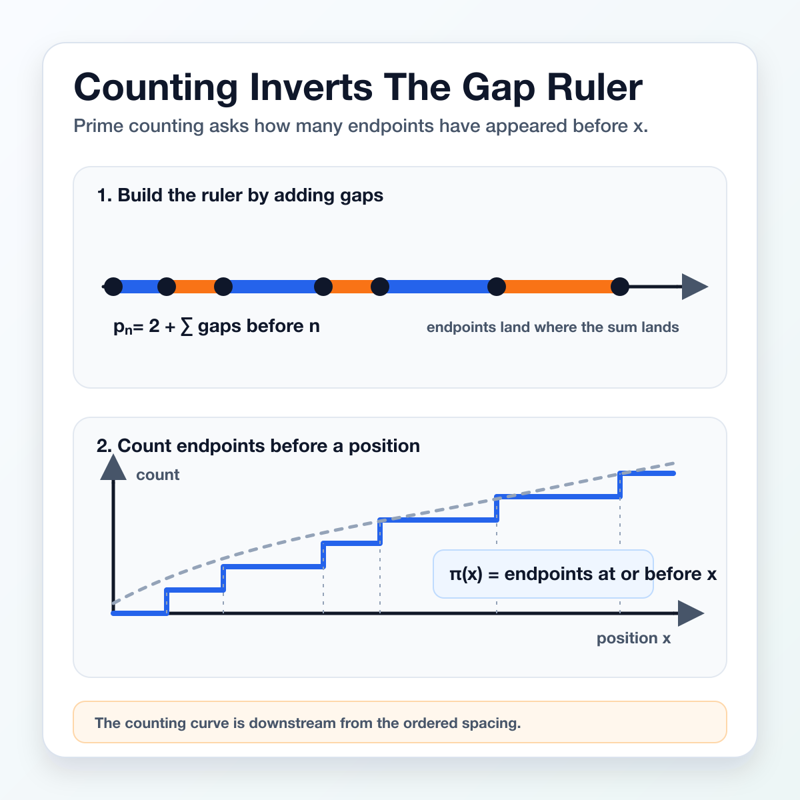
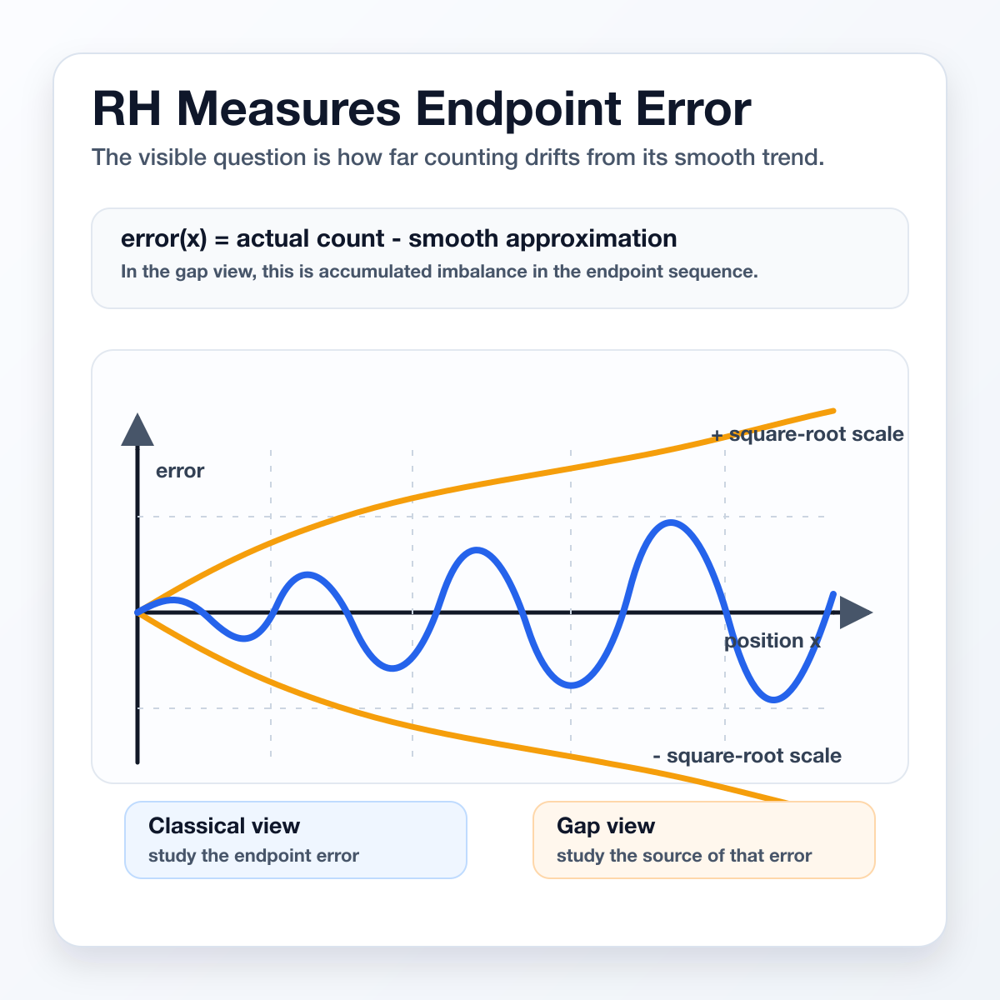
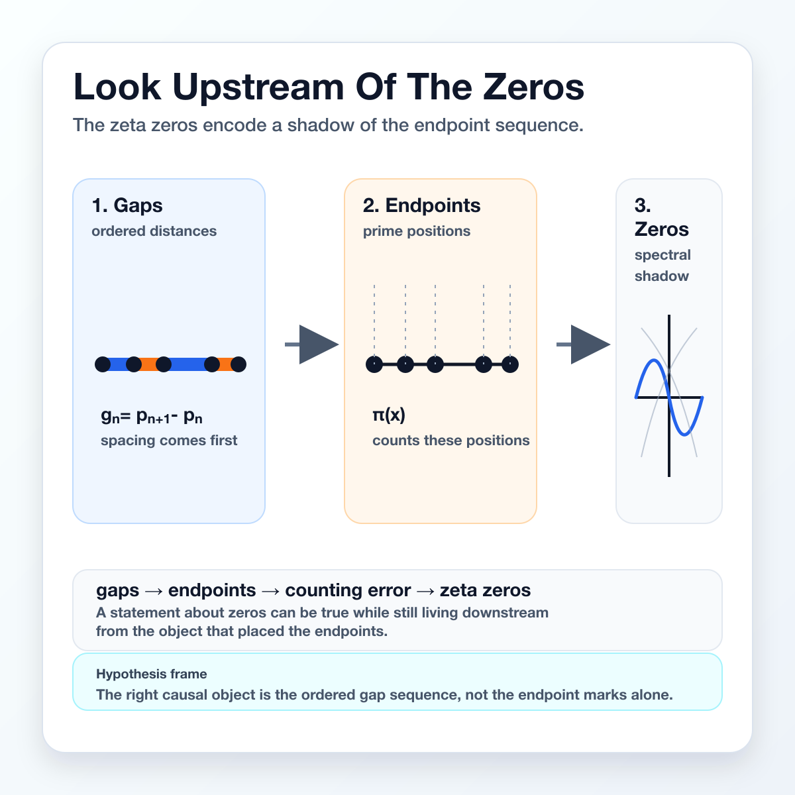

The Riemann Hypothesis is usually described as a statement about prime numbers.

A cleaner causal picture starts one step earlier. Prime numbers are not the motion. They are the marks left behind after the motion has happened.

The motion is the ordered sequence of gaps between consecutive primes. The primes are endpoints of those gaps.

---

Take the primes in order. The distance from one prime to the next is a prime gap.

Once the first prime is fixed, the later primes are determined by the accumulated gaps. Each new prime is the next endpoint reached by adding the next gap.

So primes are visible consequences of an ordered gap structure.

---

Prime counting looks like it counts objects, but it also inverts a ruler.

The ruler is built by accumulating gaps. The prime-counting function asks how many endpoints have appeared before a given position.

That turns the distribution of primes into a downstream measurement of the gap sequence.

---

The Riemann Hypothesis concerns the size of the error between prime counting and its smooth approximation.

In this framing, that error is not caused by primes as independent objects. It is the accumulated imbalance left by the ordered gaps.

The critical question becomes whether that imbalance is always confined to the square-root scale.

---

The zeta function sees the shadow cast by the endpoints. Its zeros encode deep regularity in that shadow.

But if primes are endpoints, the more direct object is the gap sequence that places them.

The hypothesis is not that prime numbers are unimportant. It is that they are effects. The cause is the ordered structure of the gaps.

