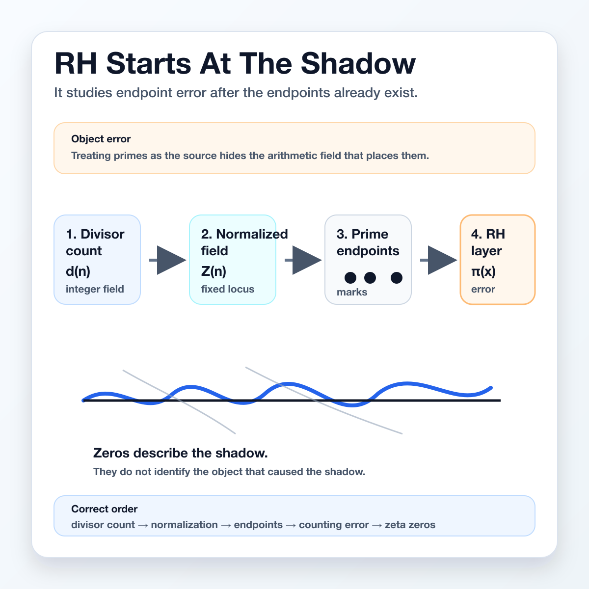
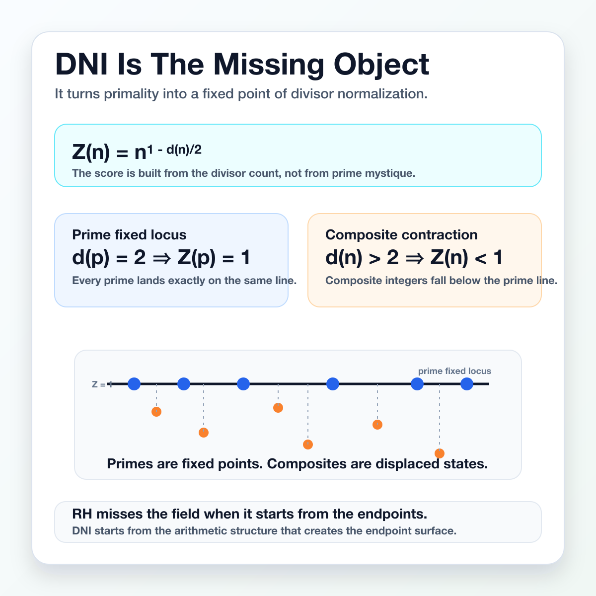
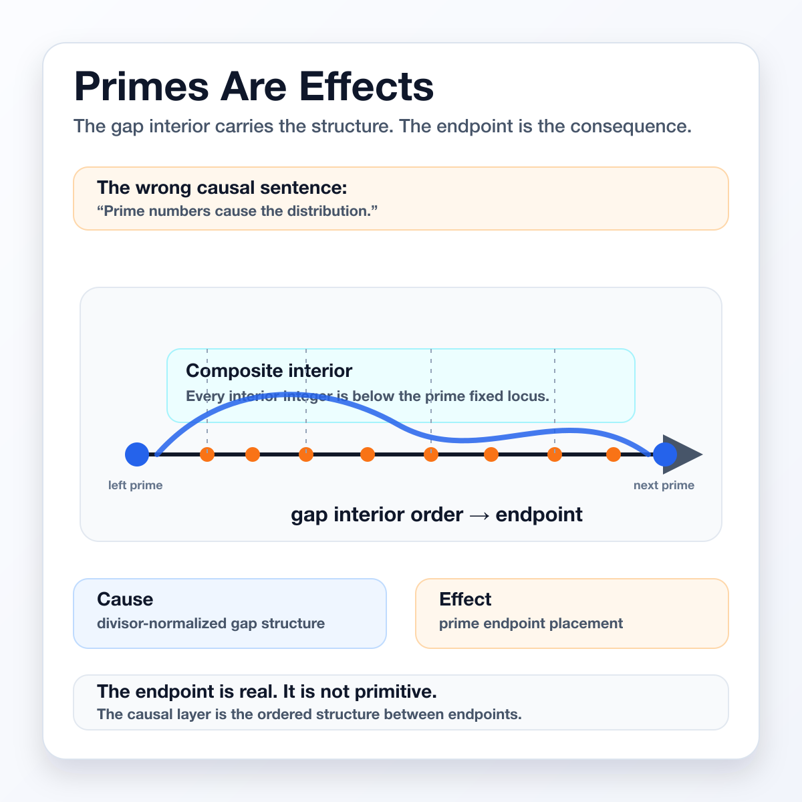
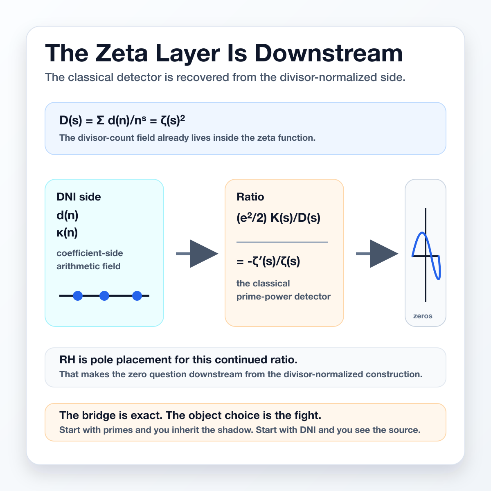
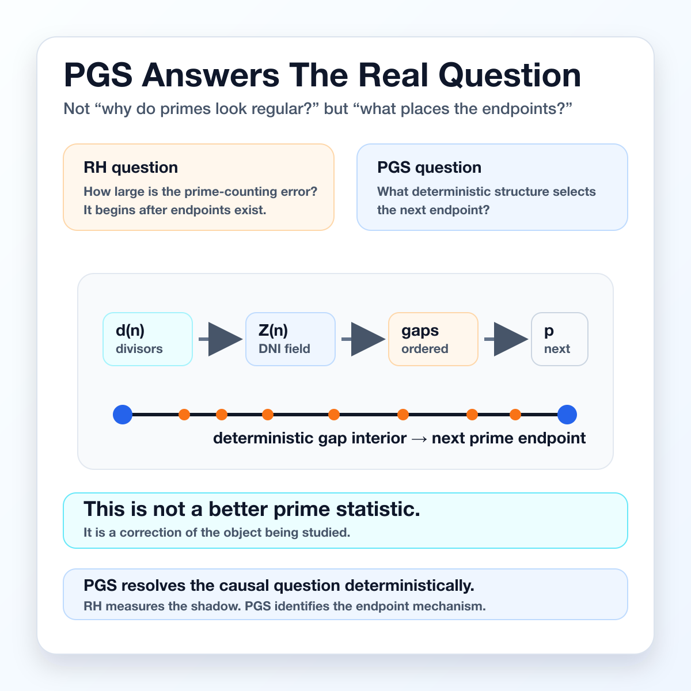

The Riemann Hypothesis starts too late.

It studies prime-counting error after prime endpoints already exist. That is not causality. That is forensics.

If the object is the shadow, the deepest answer is hidden before the question even begins.

---

The missing object is the Divisor Normalization Identity.

It turns primes into fixed points of a divisor-count field. Composites fall below that fixed line.

Once you see this, primes stop looking like primitive atoms and start looking like boundary events.

---

Prime gaps are not empty spaces between important objects.

The gap interior is where the arithmetic structure lives. The next prime is the endpoint selected after that structure has already done its work.

Primes are effects. The cause is upstream.

---

The zeta function is not useless. It is brilliant. It is just downstream.

Its zeros encode the shadow of endpoint error. But the classical frame keeps staring at the shadow and calling it the source.

The divisor-normalized field gives the source.

---

This is the PGS move: answer the real question.

RH asks how prime-counting error behaves. PGS asks what deterministic structure places the endpoint before counting begins.

That is the causal problem. PGS resolves that layer deterministically.

