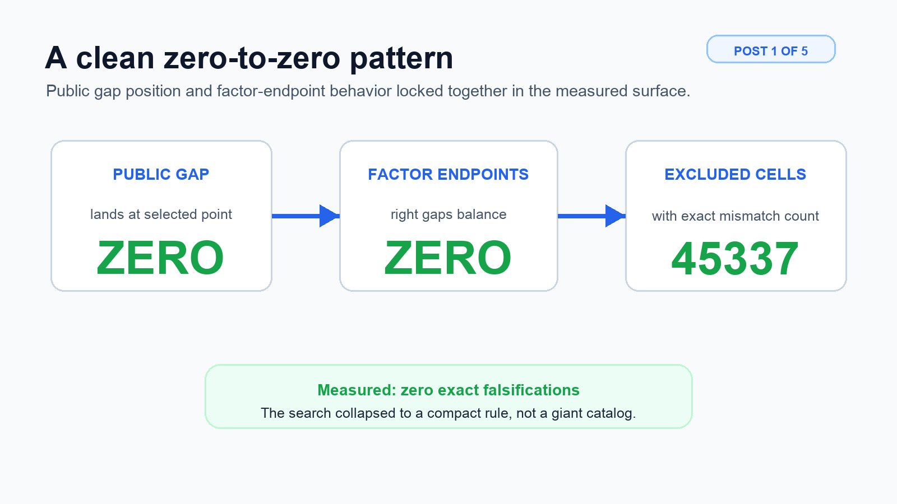
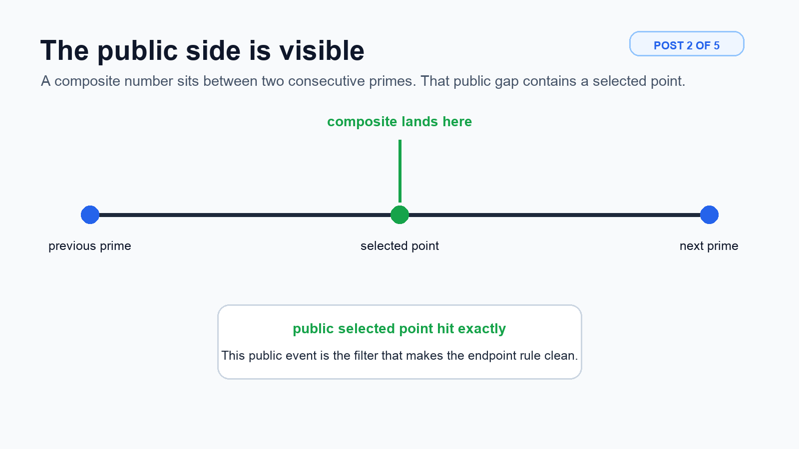
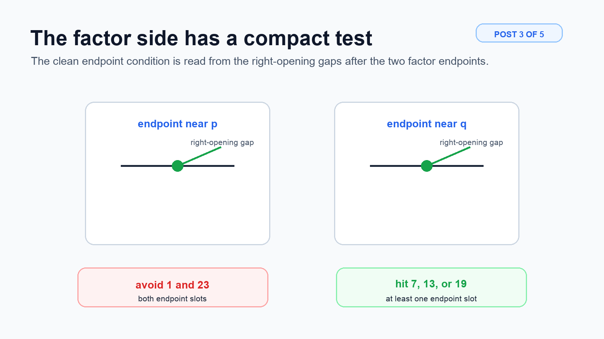
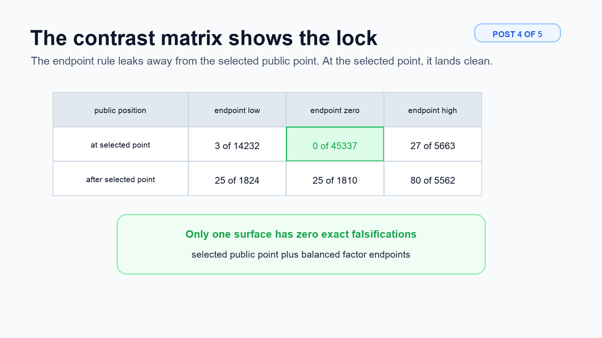
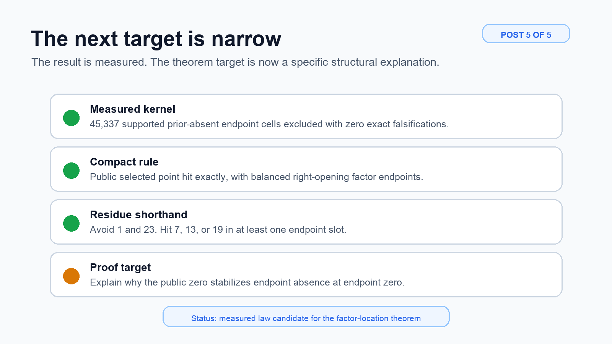

We found a clean zero-to-zero pattern in prime gaps: when the public gap lands exactly at its selected point and the hidden factor endpoints have balanced right gaps, 45,337 impossible endpoint cells were excluded with zero exact falsifications. Save this if you are tracking the factor-location branch.

---

Start with the public side. A composite number sits inside a gap between two consecutive primes. That visible gap contains a selected point computed from the gap's own divisor structure. In the clean case, the composite lands exactly at that selected point. That public hit is the filter to watch.

---

Now look at the factor side. Each hidden prime factor has neighboring gaps around it. The clean endpoint condition is read from the right-opening gaps after the two factor endpoints. In residue language, both endpoint slots avoid 1 and 23, and at least one endpoint slot hits 7, 13, or 19. This is the piece worth stress-testing.

---

The contrast test is what makes this sharp. Endpoint balance alone leaks when the composite is not at the selected public point. At the selected point, balanced endpoints give 45,337 excluded cells and zero falsifications. Move away from that public point and the same endpoint idea starts leaking. This matrix is the shareable evidence.

---

This is a measured law candidate for the factor-location theorem. Broad representation search is done for this layer. The proof target is now narrow: explain why the public zero stabilizes supported prior absence exactly at endpoint zero. Follow the next step: turn the measured kernel into the theorem.

