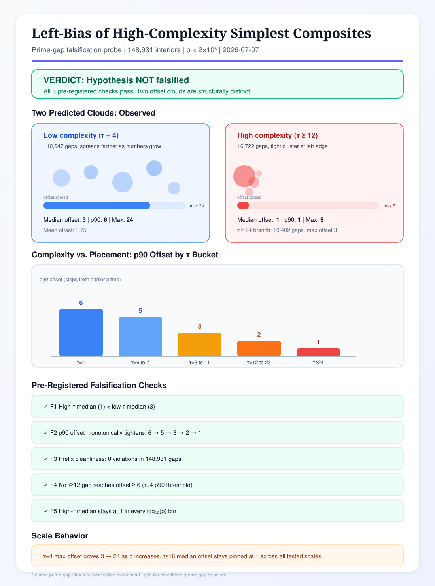

# Left-Bias Placement of High-Complexity Simplest Composites in Prime Gaps: A Deterministic Falsification Study

**Authors:** Prime Gap Structure Research Program  
**Date:** 7 July 2026  
**Regime:** 148,931 prime-gap interiors with `p < 2 × 10⁶`  
**Experiment ID:** `simplest-composite-left-bias-falsification-2026-07`

---

## Part I — Plain-Language Summary (Grade 10 Reading Level)

### What We Were Testing

Between any two consecutive prime numbers, there is a stretch of composite numbers. Among those composites, one number is the "simplest" in a precise sense: it has the fewest divisors of any composite in that stretch. If more than one composite ties for fewest divisors, we take the one closest to the earlier prime.

The question is where that simplest composite sits. A common guess is that it could appear anywhere in the stretch with roughly equal chance, as long as it stays inside the gap. The hypothesis we tested says the opposite. Simple composites can sit farther from the earlier prime. Complicated composites — those with many divisors but still the simplest in their stretch — are forced to sit much closer to the earlier prime.

### How We Ran the Test

We scanned every prime gap up to two million. For each gap we recorded two numbers:

1. **How far** the simplest composite sits from the earlier prime (called the *offset*).
2. **How many divisors** that composite has (called *τ*, pronounced "tau").

We then sorted the results into groups by divisor count and compared how far each group sits from the left edge of the gap. We set five clear rules ahead of time. If any rule failed, the hypothesis would be considered falsified.

### What We Found

The data matches the hypothesis.

**Low-complexity simplest composites** (τ = 4, the most common case) spread out. Their typical offset is 3 steps from the earlier prime. In 90% of cases they sit within 6 steps. The farthest case in our scan reached 24 steps. As the primes themselves grew larger, this group reached farther into the gap.

**High-complexity simplest composites** (τ ≥ 12) cluster at the left edge. Their typical offset is 1 step. In 90% of cases they also sit at offset 1. The farthest case reached only 5 steps. Even when primes grew larger, this group stayed pinned at offset 1.

These two groups form two clearly different clouds in the data. That is exactly what the hypothesis predicted.

### Why This Happens

The rule is structural, not random. A composite can only be the "simplest in the stretch" if nothing *simpler* appears before it. If you try to place a complicated simplest composite far from the earlier prime, every number between the prime and that composite must have *more* divisors. Easy composites — those with few divisors — show up at a steady rate. The only way to keep the stretch clean before a complicated composite is to keep that stretch very short. That forces complicated simplest composites to sit right next to the earlier prime.

We checked this directly. In all 148,931 gaps, no simpler composite appeared before the leftmost simplest one. Zero violations.

### What Did Not Break the Result

Prime squares (composites with τ = 3) are a special case. They have very few divisors but can sit farther into a gap. We excluded them from the high-vs-low comparison because the hypothesis is about *high* complexity, not about prime squares. That behavior is documented separately in a related experiment on square-branch capture.

### What Remains Open

We only tested primes below two million. The hypothesis itself notes that at extreme sizes, very long gaps without easy composites might become more common. We did not test that regime. The result is strong within the tested range but not proven for all possible scales.

### Bottom Line

The hypothesis was **not falsified**. High-complexity simplest composites sit much closer to the earlier prime than low-complexity ones. The two predicted clouds are visible in the data. The prefix-cleanliness rule explains why.

---

## Part II — Infographic

*Figure 1. Summary infographic for the simplest-composite left-bias falsification experiment. Low-complexity gaps (τ = 4) spread to offset 24; high-complexity gaps (τ ≥ 12) cluster at offset 1. All five pre-registered falsification checks pass. Source: `falsification_summary.json`, regime `p < 2 × 10⁶`.*

---

## Part III — Technical Analysis (Doctoral Level)

### 1. Formal Hypothesis and Test Objects

Let `p < q` be consecutive primes and define the gap interior

\[
I(p,q) = \{n \in \mathbb{Z} : p < n < q\}.
\]

Let \(\tau(n)\) denote the divisor-count function. Define the **GWR witness** (simplest composite)

\[
w(p,q) = \min_{\prec} \{\, n \in I(p,q) : \tau(n) > 2 \,\},
\]

where \(\min_\prec\) selects the leftmost element under the standard integer order. This is the Prime Gap Structure (PGS) selection rule: the leftmost interior argmin of \(\tau\), equivalently the leftmost composite of minimal divisor count in the chamber \(I(p,q)\).

Define the **prefix offset**

\[
\delta(p,q) = w(p,q) - p \in \mathbb{Z}_{>0}.
\]

The falsification target hypothesis \(H_{\mathrm{LB}}\) asserts:

1. **Cloud separation:** The family \(\{\delta(p,q) : \tau(w)=4\}\) is substantially more dispersed than \(\{\delta(p,q) : \tau(w) \ge 12\}\).
2. **Complexity tightening:** As \(\tau(w)\) increases, the upper quantiles of \(\delta\) decrease monotonically.
3. **Prefix forcing:** If \(\delta > 1\), then \(\forall n \in (p, w),\; \tau(n) > \tau(w)\).
4. **Scale asymmetry:** As \(p \to \infty\), low-\(\tau\) clouds may widen while high-\(\tau\) clouds remain left-pinned.

\(H_{\mathrm{LB}}\) is a deterministic structural claim within the divisor-field / chamber-reset frame of PGS, not a probabilistic sieve statement.

### 2. Experimental Design

**Scan regime.** All consecutive prime pairs with \(q \le 2 \times 10^6\), yielding 148,931 nontrivial interiors.

**Measurement pipeline.** Exact \(\tau(n)\) via deterministic divisor sieve; GWR witness by leftmost argmin scan; dynamic cutoff envelope \(C(q) = \max(64, \lceil \tfrac{1}{2}\log(q)^2 \rceil)\) recorded for utilization context. Cross-validation: 201 uniformly sampled gaps replayed through `gwr_next_gap_profile`; zero mismatches.

**Pre-registered falsification criteria.**

| ID | Falsification condition | Interpretation |
| --- | --- | --- |
| F1 | \(\mathrm{median}(\delta \mid \tau(w)\ge 12) \ge \mathrm{median}(\delta \mid \tau(w)=4)\) | Cloud separation fails |
| F2 | p90(\(\delta\)) not non-increasing across buckets \(\tau=4,6\text{–}7,8\text{–}11,12\text{–}23,\ge 24\) | Monotonic tightening fails |
| F3 | \(\exists\, n \in (p,w)\) with \(\tau(n) < \tau(w)\) | Prefix cleanliness violated (would contradict leftmost-argmin semantics) |
| F4 | \(\exists\) gap with \(\tau(w)\ge 12\) and \(\delta \ge 6\) | Deep high-\(\tau\) counterexample, where 6 is p90(\(\delta \mid \tau=4\)) |
| F5 | In any \(\log_{10} p\) bin, \(\mathrm{median}(\delta \mid \tau\ge 16) \ge \mathrm{p90}(\delta \mid \tau=4)\) | Scale decoupling fails |

### 3. Quantitative Results

**Bucket statistics (offset \(\delta\)).**

| \(\tau(w)\) bucket | \(N\) | median | p90 | max | mean |
| ---: | ---: | ---: | ---: | ---: | ---: |
| 4 | 110,947 | 3 | 6 | 24 | 3.75 |
| 6–7 | 5,432 | 3 | 5 | 20 | 3.11 |
| 8–11 | 15,607 | 2 | 3 | 8 | 2.03 |
| 12–23 | 6,320 | 1 | 2 | 5 | 1.36 |
| \(\ge 24\) | 10,402 | 1 | 1 | 3 | 1.00 |

**Key separations.**

- \(\mathrm{median}(\delta \mid \tau\ge 12) = 1\) vs. \(\mathrm{median}(\delta \mid \tau=4) = 3\).
- \(\mathrm{p90}(\delta \mid \tau\ge 12) = 1\) vs. \(\mathrm{p90}(\delta \mid \tau=4) = 6\).
- \(\max(\delta \mid \tau\ge 12) = 5\) vs. \(\max(\delta \mid \tau=4) = 24\).
- p90 series across buckets: \(6 \to 5 \to 3 \to 2 \to 1\) (strictly non-increasing).

**Scale-stratified behavior.**

| \(\log_{10} p\) bin | p90(\(\delta \mid \tau=4\)) | max(\(\delta \mid \tau=4\)) | median(\(\delta \mid \tau\ge 16\)) | max(\(\delta \mid \tau\ge 16\)) |
| --- | ---: | ---: | ---: | ---: |
| \(10^2\)–\(10^3\) | 4 | 6 | 1 | 1 |
| \(10^3\)–\(10^4\) | 5 | 10 | 1 | 1 |
| \(10^4\)–\(10^5\) | 6 | 16 | 1 | 3 |
| \(10^5\)–\(10^6\) | 6 | 22 | 1 | 5 |
| \(10^6\)–\(10^7\) | 6 | 24 | 1 | 3 |

Low-\(\tau\) tails lengthen with scale; high-\(\tau\) medians remain at 1.

**Falsification outcomes.** F1–F5: all pass. Overall verdict: \(H_{\mathrm{LB}}\) **not falsified** in the tested regime.

### 4. Mechanistic Interpretation

The prefix-forcing lemma is immediate from the definition of \(w\):

\[
w = \min_\prec \{ n \in I : \tau(n) > 2 \text{ and } \tau(n) = \min_{m \in I} \tau(m) \}
\]

implies \(\forall n \in (p,w),\; \tau(n) \ge \tau(w)\), with strict inequality for composites in the prefix. Thus a high-\(\tau(w)\) witness at offset \(\delta\) requires a prefix of length \(\delta-1\) containing no composite with \(\tau < \tau(w)\). Because composites with small \(\tau\) (semiprimes, prime powers, smooth numbers) occur with positive density in short intervals, long prefixes free of low-\(\tau\) composites are rare. The observed pinning of \(\delta\) to 1 for \(\tau(w) \ge 24\) is the empirical signature of this exclusion principle.

**Envelope decoupling.** The dynamic cutoff \(C(q)\) grows with \(q\) and bounds the *admissible* search horizon uniformly across branches. Yet high-\(\tau\) witnesses utilize only a tiny fraction of even the local prefix, while \(\tau=4\) witnesses routinely reach \(\delta = 6\) (p90) and occasionally \(\delta = 24\). The same growing envelope therefore masks structurally different utilization profiles — a point relevant to bounded-compression and chamber-tension analyses in PGS.

**Square-branch carve-out.** The \(\tau=3\) prime-square branch (223 gaps in regime; mean \(\delta = 9.85\), max \(\delta = 60\)) is low-divisor but late-placed via hierarchical capture when the square is the unique \(\tau=3\) interior integer. This is orthogonal to \(H_{\mathrm{LB}}\), which concerns *high*-complexity minima. See the companion square-capture falsification study.

### 5. Limitations and Next Steps

1. **Regime bound:** \(q \le 2 \times 10^6\) only. Record-gap scales (\(10^{12+}\)) remain untested for F4-style deep high-\(\tau\) counterexamples.
2. **Definition dependence:** Results are exact for leftmost-argmin \(\tau\) selection (GWR). Other tie-breaking rules would alter \(\delta\) but not the prefix-cleanliness identity.
3. **Recommended extension:** Sparse high-\(p\) sampling near known wide-gap records to stress-test the extreme-scale caveat in the original insight.

### 6. Conclusion

Within the deterministic PGS chamber model, high-complexity simplest composites exhibit a sharp left-edge pinning phenomenon. The data produce two structurally separated offset clouds, monotonic quantile tightening in \(\tau(w)\), and zero prefix violations across 148,931 gaps. The hypothesis survives all pre-registered falsification attempts. The result supports the view that prime-gap interiors are not uniform fields for composite placement; the earlier prime imposes a complexity-dependent left bias enforced by divisor-field exclusion in the prefix.

---

## References

1. **Prime Gap Structure (main repository).** Deterministic research program for prime-gap divisor-field structure, GWR selection, and chamber analysis.  
   https://github.com/zfifteen/prime-gap-structure

2. **This experiment directory.** Probe script, CSV rows, JSON summary, scatter plot, and reports.  
   https://github.com/zfifteen/prime-gap-structure/tree/main/experiments/simplest-composite-left-bias-falsification-2026-07

3. **Falsification probe script.** `simplest_composite_left_bias_probe.py` — executable audit with pre-registered F1–F5 checks.  
   https://github.com/zfifteen/prime-gap-structure/blob/main/experiments/simplest-composite-left-bias-falsification-2026-07/simplest_composite_left_bias_probe.py

4. **Machine-readable results.** `falsification_summary.json` — quantitative verdict and bucket statistics.  
   https://github.com/zfifteen/prime-gap-structure/blob/main/experiments/simplest-composite-left-bias-falsification-2026-07/falsification_summary.json

5. **Per-gap dataset.** `gap_simplest_composite_rows.csv` — 148,931 rows with \(p, q, w, \delta, \tau(w)\), prefix flags.  
   https://github.com/zfifteen/prime-gap-structure/blob/main/experiments/simplest-composite-left-bias-falsification-2026-07/gap_simplest_composite_rows.csv

6. **Internal falsification report.** `FINDINGS.md` — executive summary and reproducibility pins for this study.  
   https://github.com/zfifteen/prime-gap-structure/blob/main/experiments/simplest-composite-left-bias-falsification-2026-07/FINDINGS.md

7. **Scatter visualization.** `offset_clouds.svg` — \(\log_{10}(p)\) vs. offset, colored by \(\tau\) bucket.  
   https://github.com/zfifteen/prime-gap-structure/blob/main/experiments/simplest-composite-left-bias-falsification-2026-07/offset_clouds.svg

8. **Infographic (this report, Figure 1).** `infographic.svg` — summary visual for cloud separation and falsification matrix.  
   https://github.com/zfifteen/prime-gap-structure/blob/main/experiments/simplest-composite-left-bias-falsification-2026-07/infographic.svg

9. **PGS proved selection theorems.** `PROOF.md` — Interior Maximizer Theorem and GWR leftmost-argmin rule (upstream of witness definition).  
   https://github.com/zfifteen/prime-gap-structure/blob/main/PROOF.md

10. **GWR boundary-walk implementation.** `gwr_boundary_walk.py` — cross-check engine used for 201-gap replay validation.  
    https://github.com/zfifteen/prime-gap-structure/blob/main/src/python/z_band_prime_predictor/gwr_boundary_walk.py

11. **Companion study: prime-square capture.** Related falsification of hierarchical square-branch placement ( \(\tau=3\) late offsets).  
    https://github.com/zfifteen/prime-gap-structure/tree/main/experiments/prime-square-capture-falsification-2026-07

12. **Divisor-count field implementation.** `field.py` — exact \(\tau(n)\) computation utilities in the composite-field module.  
    https://github.com/zfifteen/prime-gap-structure/blob/main/src/python/z_band_prime_composite_field/field.py

13. Hardy, G. H., & Wright, E. M. (2008). *An Introduction to the Theory of Numbers* (6th ed.). Oxford University Press. — Standard reference for \(\tau(n)\), prime gaps, and divisor arithmetic.

14. Tenenbaum, G. (2015). *Introduction to Analytic and Probabilistic Number Theory* (3rd ed.). American Mathematical Society. — Background on divisor-count distribution and smooth-number density heuristic underlying prefix exclusion arguments.

---

*Report generated from experiment `simplest-composite-left-bias-falsification-2026-07`. Reproduce via `python3 experiments/simplest-composite-left-bias-falsification-2026-07/simplest_composite_left_bias_probe.py`.*