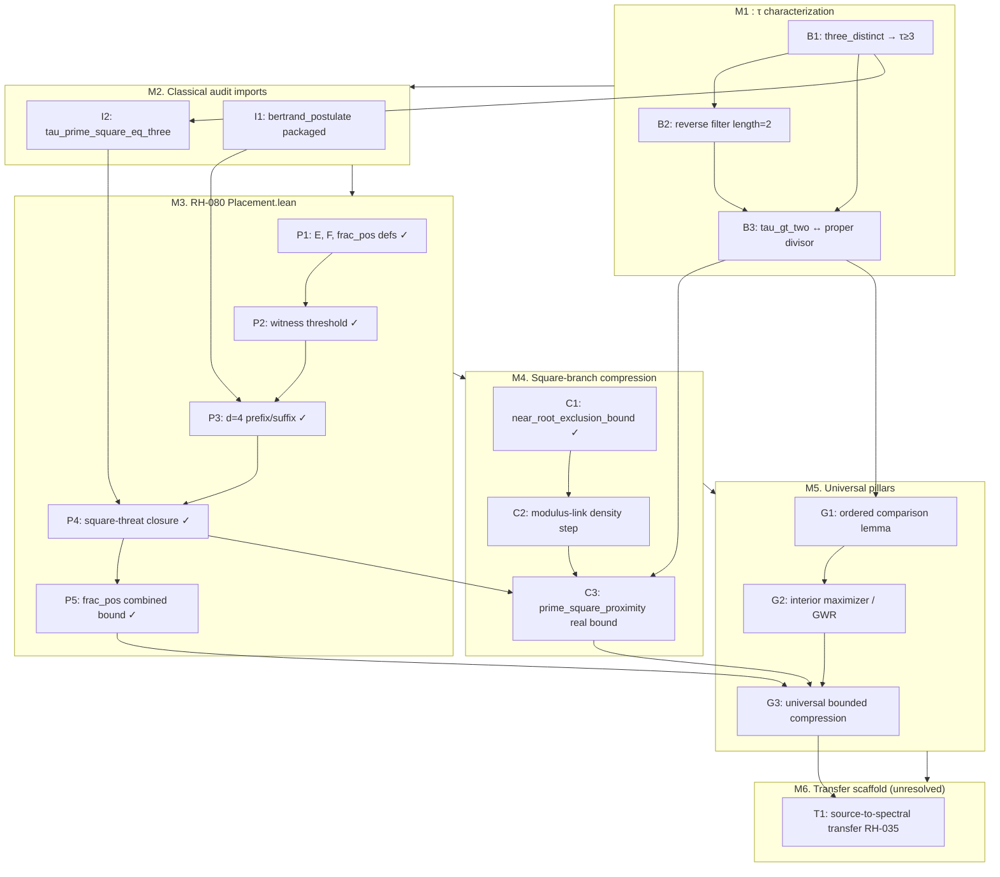

# Lean Placement Formalization Roadmap

**Issue:** [GitHub #49: RH-corpus Q11](https://github.com/zfifteen/prime-gap-structure/issues/49)  
**Date:** 2026-07-08  
**Authority:** `PROOF.md` (theorem status) · `LEAN_PGS_VERIFICATION_CONTRACT.md` (Lean discipline)  
**Scope:** Placement stack only: d=4 geometry, square-branch bounded compression, and prerequisite τ machinery.  
**Boundary:** Lean port ≠ RH proof. Transfer lemma (RH-035) and pole-placement (RH-051) are downstream and unresolved.

---

## Executive summary

The proved placement stack in prose lives in three surfaces:

1. **`PROOF.md`**: Interior Maximizer, witness threshold, large-divisor closure, Prime-Square Proximity.
2. **`research/pgs-rh-placement-empirics-2026-06/d4_fractional_position_bound.md`**: d=4 fractional-position lemmas (RH-030 to 032).
3. **`lean-4/PGS/Placement.lean`** + **`lean-4/PGS/ChamberReset.lean`**: partial machine-checked mirror.

This roadmap orders the **minimal closure DAG** to move RH-080/081 from partial scaffold to a faithful end-to-end Lean mirror of the proved placement layer, without conflating it with RH-corpus Q1 to Q5 (pole placement, transfer lemma, deconvolution).

**Milestone M0 (this deliverable):** inventory + dependency DAG + `lake build` green on existing scaffold.

---

## Current inventory (2026-07-08)

### Proved in Lean (no `sorry` in proof body)

| Lean identifier | Module | Prose source | Notes |
|-----------------|--------|--------------|-------|
| `near_root_exclusion_bound` | `ChamberReset.lean` | `PROOF.md` §Prime-Square Proximity (algebraic core) | Algebraic near-root exclusion : **proved** |
| `audit_demoted_tau2` | `ChamberReset.lean` | weak L_FCL demotion bridge | Audit demotion τ=2 |
| `weak_lfcl_ruleX_forces_next_prime` | `ChamberReset.lean` | weak sufficient-bound certificate | L5 closed 2026-07-05 |
| `gwr_d4_*` (Phases 1 to 5) | `Placement.lean` | `d4_fractional_position_bound.md` | 12+ corollaries machine-checked |
| `witnessThreshold_*` | `Placement.lean` | `PROOF.md` §Witness Threshold Lemma | Threshold algebra |

### Open obligations (block full mirror)

| Kind | Lean identifier | Module | Prose source | Blocker |
|------|-----------------|--------|--------------|---------|
| `sorry` | `three_distinct_divisors_imply_tau_ge_three` | `Basic.lean` | `PROOF.md` L80 to 81 | Pure-List counting; deferred Phase 2 Mathlib |
| `sorry` | `tau_eq_two_iff` reverse length step | `Basic.lean` | `PROOF.md` L80 to 81 | Symmetric counting deferral |
| `sorry` | `tau_gt_two_iff_has_proper_divisor` | `Basic.lean` | `PROOF.md` L80 to 81 | Depends on counting lemmas |
| `theorem` | `bertrand_postulate` | `Placement.lean` | `PROOF.md` CL-001 | **Proved** (Mathlib Bertrand + consecutive-prime specialization) |
| `axiom` | `tau_prime_square_eq_three` | `Placement.lean` | `PROOF.md` CL-003 | Axiom pending M1 counting closure |
| `axiom` | `replay_some_under_hyps` etc. (3) | `ChamberReset.lean` | Rule X replay bridge | Replay bridge lemmas; L5 uses them but they're still axioms |
| trivial | `prime_square_proximity_theorem` | `ChamberReset.lean` | `PROOF.md` §Prime-Square Proximity | Currently `∃ C, r² - p ≤ C` by reflexivity : **not a faithful mirror** |
| placeholder | `PGS/GWR.lean` | : | `PROOF.md` §Interior Maximizer | Empty module |
| placeholder | `PGS/NextPrime.lean` | : | `PROOF.md` §Why Algorithm Returns Next Prime | Not started |

### Repro gate (M0)

```bash
cd lean-4 && lake build
# Expected: Build completed successfully; 3 sorry warnings in PGS/Basic.lean only
```

---

## Dependency DAG (minimal closure order)

Nodes are listed in **topological order**. An edge `A → B` means *B depends on A*.



**Critical path for `ACTIVE_TARGET.md`:** M1 → M2 → M4 (C2, C3).  
M3 is largely complete (RH-080). M5 to M6 extend beyond placement into full `PROOF.md` stack.

---

## Ordered lemma list (work packages)

### M0: Roadmap and green build ✓

| ID | Deliverable | Status |
|----|-------------|--------|
| M0.1 | This document with DAG + mapping tables | **Complete** |
| M0.2 | `lake build` green on existing scaffold | **Complete** |
| M0.3 | FINDINGS_INDEX RH-080/081 notes updated | **Complete** |

### M1: τ characterization closure (`PGS/Basic.lean`)

| ID | Lean target | PROOF.md | Priority | Depends |
|----|-------------|----------|----------|---------|
| M1.1 | `three_distinct_divisors_imply_tau_ge_three` | L80 to 81 | P0 | : |
| M1.2 | `tau_eq_two_iff` reverse length | L80 to 81 | P0 | M1.1 |
| M1.3 | `tau_gt_two_iff_has_proper_divisor` | L80 to 81 | P1 | M1.1, M1.2 |
| M1.4 | `prime_iff_tau_eq_two` (exported) | L80 to 81 | P1 | M1.1 to M1.3 |

**Strategy:** Controlled Mathlib `Finset`/`Nat.divisors` counting, or finish pure-List pigeonhole proofs.  
**Gate:** `lake build` with zero `sorry` in `Basic.lean`.

### M2: Classical audit packaging (`PGS/Placement.lean`)

| ID | Lean target | PROOF.md / issue | Priority | Depends |
|----|-------------|------------------|----------|---------|
| M2.1 | Replace `bertrand_postulate` axiom with proved theorem | §Witness Threshold; §Large-Divisor; CL-001 ([#31](https://github.com/zfifteen/prime-gap-structure/issues/31)) | P1 |: |
| M2.2 | Prove `tau_prime_square_eq_three` from `tau` | §Prime-Square Case; CL-003 | P1 | M1.1 |

**Strategy:** Bertrand lives in an explicitly labelled `PGS.Classical` namespace: audit import, not PGS inference.  
**Gate:** `#print axioms` on `Placement.lean` theorems shows no undeclared axioms beyond Lean core + labelled classical block.

### M3: d=4 placement corollaries (RH-080)

| ID | Lean target | Prose source | Status |
|----|-------------|--------------|--------|
| M3.1 | `gwr_d4_frac_pos_bound` and Phase 1 to 5 lemmas | `d4_fractional_position_bound.md` §2 to 6 | **Proved** |
| M3.2 | Map every `Placement.lean` theorem to RH-030/031/032 row | FINDINGS_INDEX | Open |
| M3.3 | Add header traceability blocks per `LEAN_PGS_VERIFICATION_CONTRACT.md` | Contract §Traceability | Open |

**Gate:** `pgs-rh-placement-invariants.lean` smoke `#check` lines remain green; RH-080 boundary reads "Phases 1 to 5 proved; axioms M2 pending."

### M4: Prime-Square Proximity faithful mirror (`PGS/ChamberReset.lean`)

| ID | Lean target | PROOF.md | Priority | Depends |
|----|-------------|----------|----------|---------|
| M4.1 | `near_root_exclusion_bound` | §Prime-Square Proximity (algebraic block) | **Proved** |: |
| M4.2 | Modulus-link density / tiling contradiction | §Prime-Square Proximity (651 to 666); shortcomings S1 | P0 | M4.1, M2.2 |
| M4.3 | `prime_square_proximity_theorem` with explicit `C = max(64, ⌈0.5·log(q)²⌉)` | §Prime-Square Proximity + §Universal bounded compression | P0 | M4.2, M3.5 |
| M4.4 | Demote trivial reflexivity proof | : | P0 | M4.3 |

**Gate:** `prime_square_proximity_theorem` statement matches `PROOF.md` bound, not existential reflexivity.  
**Note:** Prose proof of M4.2 is complete per `PROOF.md`; Lean gap is formalization of density step (see `docs/proof-enhancements/shortcomings.md` S1).

### M5: GWR + universal bounded compression

| ID | Lean target | PROOF.md | Priority | Depends |
|----|-------------|----------|----------|---------|
| M5.1 | `ordered_comparison_lemma` | §Ordered Comparison Lemma (199 to 224) | P1 | M1, `Placement.E/F` |
| M5.2 | `interior_maximizer_theorem` | §Interior Maximizer (186 to 198) | P1 | M5.1 |
| M5.3 | `finite_bounded_compression_base` | §Finite Bounded-Compression (546 to 587) | P2 | audit certificate import |
| M5.4 | `universal_bounded_compression` | Headline + §Conclusion | P1 | M4.3, M5.2, M5.3 |

**Module plan:** Implement in `PGS/GWR.lean`, `PGS/BoundedCompression.lean` (new).

### M6: Transfer lemma scaffold (explicitly unresolved)

| ID | Lean target | Source | Status |
|----|-------------|--------|--------|
| M6.1 | `chamber_kernel_K` type skeleton | RH-035 transfer lemma draft | **Unresolved** |
| M6.2 | `source_to_spectral_transfer` | `source_to_spectral_transfer_lemma.md` | **Unresolved** |

Do not start M6 until M5 gate passes. No RH claims in Lean artifacts.

---

## PROOF.md mapping table (placement-relevant)

| PROOF.md section | Lines (approx) | Lean module / identifier | Milestone | Mirror status |
|------------------|----------------|--------------------------|-----------|---------------|
| Basic Objects : τ, prime ↔ τ=2 | 80 to 81, 134 to 145 | `PGS/Basic.lean` | M1 | Partial (`sorry`) |
| Interior Maximizer Theorem | 186 to 198 | `PGS/GWR.lean` (planned) | M5 | Not started |
| Ordered Comparison Lemma | 199 to 224 | `PGS/GWR.lean` (planned) | M5 | Not started |
| Witness Threshold Lemma | 315 to 358 | `Placement.witnessThreshold_*` | M3 | **Proved** |
| Prime-Square Case | 287 to 314 | `Placement.tau_prime_square_eq_three` | M2 | Axiom |
| Large-Divisor Adjacent Closure | 404 to 531 | `Placement.gwr_d4_closure_*` | M3 | **Proved** |
| Finite Bounded-Compression Base | 546 to 587 | (planned `BoundedCompression.lean`) | M5 | Not started |
| Prime-Square Proximity Theorem | 584 to 637 | `ChamberReset.near_root_*`, `prime_square_*` | M4 | Algebraic proved; main theorem trivial |
| Universal bounded compression (headline) | 40 to 44 | (planned) | M5 | Not started |
| d=4 fractional-position bound | : (empirics doc) | `Placement.gwr_d4_frac_pos_*` | M3 | **Proved** |

---

## RH finding cross-reference

| RH ID | Roadmap milestone | Next action |
|-------|-------------------|-------------|
| RH-030 | M3 | Index mapping M3.2 |
| RH-031 | M3 | Index mapping M3.2 |
| RH-032 | M3 | Index mapping M3.2 |
| RH-004 | M4 | Close M4.2 to M4.3 |
| RH-080 | M0 to M3 | Phases 1 to 5 proved; track M2 axioms |
| RH-081 | M0, M3 | Smoke entry re-export; expand when M3.2 done |
| RH-035 | M6 | Deferred, unresolved proof target |

---

## Acceptance criteria checklist (#49)

| Criterion | Evidence |
|-----------|----------|
| 1. Ordered lemma list with dependencies (DAG) | §Dependency DAG + §Ordered lemma list above |
| 2. Each item maps to PROOF.md or placement doc | §PROOF.md mapping table |
| 3. `lake build` green for scoped milestones | M0 repro gate; run before each milestone merge |
| 4. FINDINGS_INDEX RH-080/081 notes updated | See `research/19-rh-corpus/FINDINGS_INDEX.md` |

---

## Recommended next issue after M0

**[#31: S5 Bertrand hypothesis packaging](https://github.com/zfifteen/prime-gap-structure/issues/31)**: unblocks M2.1 and is the first prose fix that directly feeds the placement Lean mirror.

Then **M1** (τ counting closure) or **M4.2** (modulus-link density formalization) depending on whether prose hardening or Lean algebraic work is preferred.

---

## Related artifacts

- `lean-4/PGS_LEAN_FORMALIZATION_PLAN.md`, executive phase overview
- `docs/lean-pgs-verification/PGS_LEAN_TRANSLATION_PLAN.html`, detailed translation matrix
- `docs/proof-enhancements/shortcomings.md`, prose gaps (S1 blocks M4.3)
- `research/18-derived-half-coefficient/FORMALIZATION_PROPOSAL.md`, half-scale narrative (Phase 3 Lean follow-on)

**Maintainer rule:** Update this roadmap when any milestone gate closes. Do not mark M4 or M5 complete while `prime_square_proximity_theorem` remains reflexivity.