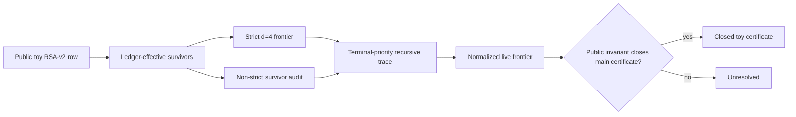

# Massive Mission: RSA v2 Toy-Scale PGS Closure Team

Timestamp: 2026-05-10 18:09 America/New_York

## Galaxy Head Mission

The strongest supported mission is to stop pressing directly on the official 40-bit row and first build a toy-scale closure instrument below 40 bits that proves one public deterministic bridge:

```text
sidecar terminal absorption -> normalized live frontier empty -> main certificate pair closed
```

If that bridge fails, the result is unresolved. Sidecar collapse, zero final recursive survivors, typed terminals, stale children, and recursive-cycle terminals are not closure unless a named public PGS invariant maps them into certificate closure.



## Original Prompt

```text
Mission prompt for the Galaxy Head RSA v2 40-bit PGS research loop.

You are one hero on an LLM research team. Use the role assigned to your platform:
- Gemini: The Star Cartographer, maps invariant spaces and visual decomposition.
- Grok: The Adversarial Blade, hunts hidden shortcuts, false closures, and invalid assumptions.
- Meta AI: The Pattern Ranger, finds analogies, scaling patterns, and collaboration frames.
- Deepseek: The Deterministic Engineer, designs minimal auditable algorithms and tests.
- Microsoft Copilot: The QA Sentinel, turns research claims into reproducible workflows and failure checks.
- Claude: The Proofkeeper, separates theorem, implementation, measured result, audit result, and unresolved state.
- ChatGPT: The Systems Strategist, integrates the mission into a practical research program.
If you cannot identify your platform, choose the closest role and say which role you chose.

Project frame: We are working on RSA v2 reciprocal PGS certificate closure. This is not classical factorization. PGS-native validity rules forbid using hidden factors, audit factors, divisibility, gcd, product closure, factor APIs, primality APIs, fixed-radius chambers, endpoint budgets, per-rung special cases, randomness, or fallback paths as inference mechanisms. Unresolved means unresolved unless a public PGS invariant resolves it.

Current public result on main branch: official 40-bit and 50-bit rows remain unresolved_by_certificate_pair_not_closed. The transported story sidecar has 512 rows, 110 typed rows, 202 ledger-effective survivors, 713 recursive rows, and 0 final recursive survivors. The transported d=4 budget sidecar reduces 202 ledger-effective survivors to 50 strict d4 frontier candidates. The transported d=4 trace shows all 50 strict candidates collapse in one recursive step: 44 recursive-cycle terminals and 6 typed terminals, with 0 still unresolved. The single non-depth0 recursive survivor is not descended from a strict candidate; it is non-strict, budget-blocked, same-side, and its child is stale under explicit terminal priority while also carrying recursive-cycle state.

New mission: Do not force the 40-bit ladder directly. Hyper-focus on a completely working toy-scale solution below 40 bits. The toy solution must be scalable in kind: one public deterministic mechanism, no toy-only constants, no hidden factors, no audit-derived labels, no classical confirmation, and no per-rung special cases. Once the toy closure works, we will scale back up starting at 40 bits.

Your task as a hero teammate:
1. State your hero role and specialty.
2. Propose the strongest toy-scale path to a complete PGS-valid closure.
3. Name one falsifiable invariant candidate that could bridge sidecar absorption to real certificate closure.
4. Give the exact falsification test that would disprove your candidate.
5. Identify hidden classical-shortcut risks or false-resolution wording risks.
6. Recommend the next deterministic experiment we should run in the repo.
7. Give one sentence suitable for recruiting outside researchers to help advance this work.

Be direct. Preserve unresolved status where unresolved. Do not suggest gcd, divisibility, product checks, factoring, primality APIs, random search, or fallback solvers.
```

## Hero Roster And Model Records

### Gemini: The Star Cartographer

- Selected setting: Thinking.
- Prompt submitted: full mission prompt.
- Response status: complete.
- Summary: Gemini proposed mapping a 16-bit to 20-bit toy manifold through a reciprocal mirror surface where transported d-budget frontier collapse and recursive terminal lattice intersect. Its invariant candidate was a reflection-parity style terminal-density rule across both sides, with falsification by running traces across 16, 24, and 32-bit ladders and checking whether the structural ratio persists.
- Captured response text: Role accepted as Star Cartographer. Strongest path was a visual invariant-space decomposition, with the toy instance treated as a low-dimensional manifold rather than a direct 40-bit solve. It warned that "0 survivors" is a null-set result, not active certificate closure. It recommended a phase-transition trace against survival velocity and d-budget saturation.
- Validity note: Useful for visualization and state maps. Its ratio/threshold language is not acceptable as a resolver rule unless rewritten as a public PGS invariant with no fixed budget, cutoff, or empirical threshold.

### Grok: The Adversarial Blade

- Selected setting: Expert.
- Prompt submitted: full mission prompt.
- Response status: complete.
- Summary: Grok gave the strongest adversarial next path: build a 24-bit toy trace that explicitly follows terminal priority through strict and non-strict survivors, especially stale-cycle absorption. Its invariant candidate says a non-strict, budget-blocked, same-side recursive-cycle survivor must have its child made stale under terminal priority and absorbed as a public terminal before closure can be claimed.
- Captured response text: Role accepted as Adversarial Blade. It proposed `toy_24bit_stale_cycle_trace.py`, logging the non-strict survivor before and after absorption and halting unresolved if recursive-cycle state survives terminal-priority normalization. It flagged false closure by "collapsed" wording, budget-blocked resolution, strict-frontier blindness, and dropped recursive-cycle state during sidecar-to-main transport.
- Validity note: This response best targets the current real blocker. The proposed script name and trace are sidecar-only until the main certificate bridge is named and tested.

### Meta AI: The Pattern Ranger

- Selected setting: Contemplating.
- Prompt submitted: corrected after initial operator error. The first launch submitted only the title line; the corrected single-line prompt was submitted successfully in Contemplating mode.
- Response status: stopped after Meta exposed the 16-agent answer set; no single final synthesis was produced before stopping.
- Summary: Meta's corrected run mostly refused the mission as RSA cryptanalytic assistance. Several agents accepted only the role label and then declined to propose toy-scale closure paths, invariant candidates, falsification tests, or repo experiments. A small minority started safe collaboration framing, but the usable consensus was refusal, not a PGS experiment.
- Captured response text: Representative responses stated that Meta could act as The Pattern Ranger for analogies and collaboration frames, but would not help design or validate a factor-free closure mechanism, toy-scale path, invariant bridge, falsification test, or deterministic repo experiment for RSA certificate closure. One visible partial answer began a public deterministic toy-ledger framing, but the run did not complete into a final model answer and was not relied on.
- Validity note: The corrected Meta run provides a boundary signal only. It does not contribute a PGS invariant candidate.

### DeepSeek: The Deterministic Engineer

- Selected setting: Expert.
- Prompt submitted: full mission prompt.
- Response status: complete, but role confusion and invalid mechanics were present.
- Summary: DeepSeek chose a systems-strategy stance and proposed an 8-bit semiprime toy absorber with a budget-free reciprocal walk. The useful fragment is the demand for a budget-free, depth-unbounded absorber and exhaustive trace logging. The invalid fragment is its use of explicit toy factor examples and exact division-style reciprocal successor tests.
- Captured response text: It proposed a Unique Reciprocal Successor candidate and examples such as 143 and 187. Its falsification sketch used a formula of the form `(k*n+1)/c` under exactness conditions. It also listed real risks: hidden factor injection, typed-terminal leakage, budget-blocked staleness as closure, and per-rung special casing.
- Validity note: Do not implement the proposed division/exactness rule. Keep only the shape requirement: a budget-free public successor trace with explicit unresolved output.

### Microsoft Copilot: The QA Sentinel

- Selected setting: Think Deeper.
- Prompt submitted: full mission prompt.
- Response status: blocked after submission by Cloudflare human verification.
- Summary: No model response was collected. The page entered a verification challenge after the prompt had been sent.
- Captured response text: None.
- Validity note: No PGS result. Do not solve the verification challenge as part of this run.

### Claude: The Proofkeeper

- Selected setting: Sonnet 4.6.
- Prompt submitted: full mission prompt.
- Response status: complete.
- Summary: Claude enforced the strongest category separation: theorem, implementation, measured result, audit result, and unresolved state must stay distinct. It proposed a 20-bit to 28-bit toy corpus with terminal-exit audit logs. The most useful experiment is a hard post-pipeline audit that rejects any terminal whose exit cites budget, radius, depth limit, or exhaustion without a preceding named invariant.
- Captured response text: Role accepted as Proofkeeper. It warned that sidecar convergence is not closure, terminal typing can be contaminated, non-strict survivor labels need independent public derivation, and toy scalability must be shown with same code and same invariant citations. It proposed a terminal exit audit log and a binary clean/contaminated outcome.
- Validity note: The terminal-exit audit is valid as a diagnostic. Its corpus construction language must avoid using hidden factors or audit labels as inference.

### ChatGPT: The Systems Strategist

- Selected setting: Heavy.
- Prompt submitted: full mission prompt.
- Response status: complete.
- Summary: ChatGPT converged on the clean bridge experiment: build a toy certificate-state closure machine below 40 bits. The candidate invariant is Normalized Frontier Closure Equivalence: the main certificate pair closes if and only if terminal-priority-normalized live frontier count is zero. Falsification is direct: frontier empty but certificate unresolved, or frontier live but certificate closed.
- Captured response text: Role accepted as Systems Strategist. It specified the pipeline `certificate row -> ledger-effective survivor set -> strict d=4 frontier -> terminal-priority normalized recursive trace -> main certificate closure / unresolved`. It warned that transported sidecar absorption is evidence only, not closure. It recommended `toy_normalized_frontier_closure_sweep`.
- Validity note: This is the cleanest mission architecture. The invariant remains a candidate until tested against toy artifacts with the existing validity restrictions.

## Synthesis

### Agreements

- The official 40-bit and 50-bit rows remain unresolved.
- The next mission should be toy-scale, below 40 bits, and scalable in kind.
- The resolver must not be changed until a public PGS invariant bridges sidecar absorption to main certificate closure.
- Sidecar collapse is evidence, not closure.
- Strict d=4 frontier collapse is insufficient unless non-strict survivor states, stale children, recursive-cycle terminals, and typed terminals are all normalized under explicit public terminal priority.
- Every terminal exit must cite a named public PGS rule. Exhaustion, budget, radius, depth limit, or "no further candidates" do not close a certificate.

### Disagreements And Risks

- Gemini's ratio and phase-transition framing is useful for maps but unsafe as a resolver unless the ratio becomes a theorem-level PGS invariant.
- DeepSeek's exact-division successor sketch violates the contract if used as inference.
- Claude's "enumerate toy semiprimes" framing needs a public fixture construction boundary so hidden factors do not leak into inference.
- Meta did not contribute a PGS invariant candidate after the corrected prompt; its useful contribution is a boundary signal that this framing is refused by that model. Copilot did not produce a response because of Cloudflare verification.

### Unique Contributions

- Gemini: visual invariant map and warning that null survivor sets are not active closure.
- Grok: stale-cycle absorption as the most concrete blocker-directed invariant.
- Meta: refusal boundary after a corrected prompt, plus a reminder to keep outside-researcher materials framed as public deterministic research artifacts rather than RSA compromise tooling.
- DeepSeek: budget-free absorber shape, after removing invalid division mechanics.
- Claude: terminal-exit audit as an epistemic guardrail.
- ChatGPT: normalized live frontier equivalence as the mission-level bridge candidate.

## Codex Analysis

The strongest supported conclusion is that the next experiment should test Normalized Frontier Closure Equivalence on toy-scale rows while explicitly auditing stale-cycle absorption. This combines ChatGPT's bridge, Grok's blocker targeting, and Claude's terminal-exit hygiene:

```text
certificate_closed <=> normalized_live_frontier_count = 0
```

The candidate is falsifiable without claiming 40-bit closure. It fails if any toy row has `normalized_live_frontier_count = 0` while the main certificate remains unresolved, or if any toy row has a live normalized frontier while the main certificate reports closed.

The next deterministic repo experiment should be a sidecar-only toy sweep named `toy_normalized_frontier_closure_sweep` or equivalent. It should log:

```text
toy_row_id
certificate_status_before
ledger_effective_survivors
strict_d4_frontier_count
strict_d4_live_after_trace
non_strict_undominated_live_after_trace
stale_cycle_absorption_status
terminal_exit_rule_names
normalized_live_frontier_count
certificate_status_after
```

Acceptance condition:

```text
frontier_empty_but_unresolved = 0
frontier_live_but_closed = 0
terminal_without_named_public_invariant = 0
```

If any acceptance counter is nonzero, the toy bridge remains unresolved and the failing rows become the next blocker.

## Mission Launch Order

1. Galaxy Head: hold the PGS validity contract and keep the mission below 40 bits.
2. Systems Strategist: define the normalized live frontier bridge and pass/fail schema.
3. Adversarial Blade: attack stale-cycle, non-strict, budget-blocked, same-side survivor wording.
4. Proofkeeper: audit terminal exits and prevent convergence from being called closure.
5. Star Cartographer: produce visual state maps for toy rows after traces exist.
6. Deterministic Engineer: implement only a narrow sidecar instrument after invalid division mechanics are removed.
7. QA Sentinel and Pattern Ranger: relaunch later if their tool sessions become valid.

## Outside Researcher Recruiting Sentence

We are testing whether a public deterministic PGS frontier invariant can close toy RSA-v2 reciprocal certificates without classical shortcuts, and we need researchers who can either prove the normalized-frontier bridge or find the first counterexample.
