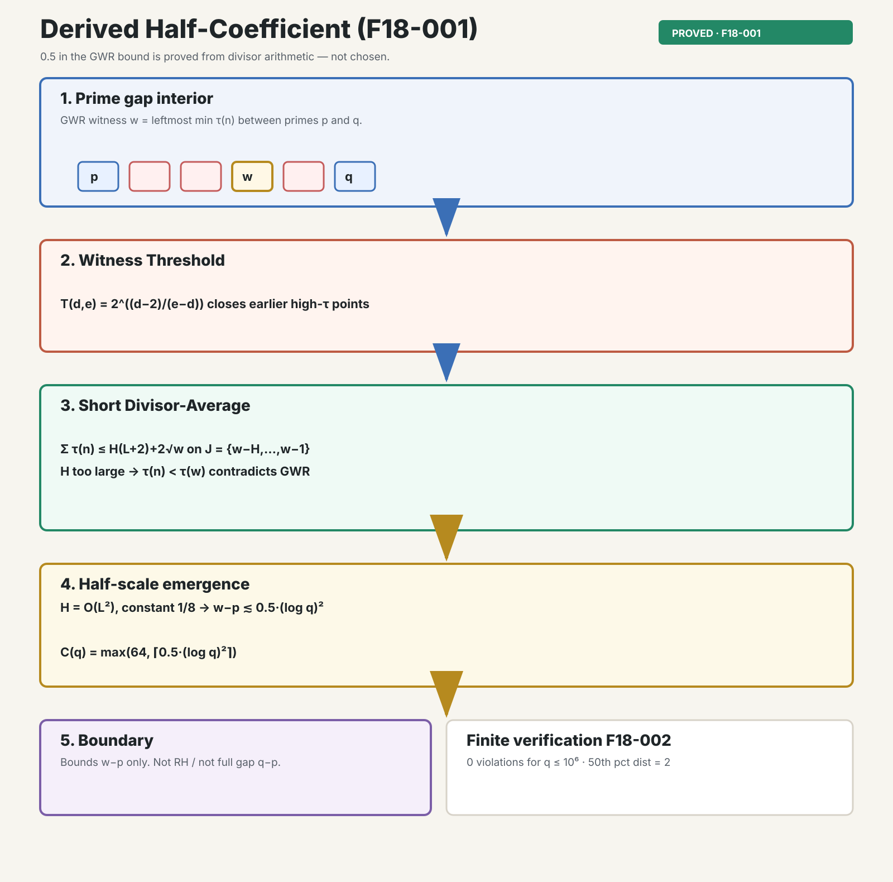

# Derived Half-Coefficient Technical Note

**Date:** 2026-07-08  
**Finding:** F18-001 — Derived Half-Coefficient  
**Status:** proved · universal  
**Authority:** `PROOF.md` · `research/04-bounded-compression/` · `research/18-derived-half-coefficient/docs/`

---

## Part I — Plain-Language Summary

Prime numbers are not separated by empty space. In the Prime Gap Structure (PGS)
view, each gap between consecutive primes contains composite numbers, and each
composite carries a **divisor count** — the number of positive integers that
divide it evenly. Every prime has divisor count $2$. Every composite has count
$3$ or higher.

Inside a gap from prime $p$ to the next prime $q$, PGS selects one special
composite called the **GWR witness** $w$. That number is the **leftmost**
interior point with the **smallest** divisor count in the gap.

A proved theorem limits how far $w$ can sit from $p$. The bound uses a cutoff
function

$$
C(q) = \max\left(64,\; \left\lceil \tfrac{1}{2}\,(\log q)^2 \right\rceil\right),
$$

and the witness offset always satisfies $w - p \le C(q)$.

The program breakthrough is where the factor $\tfrac{1}{2}$ comes from. It is
**not** chosen to match Cramér's conjecture on full gap size, and it is **not**
chosen to echo the Riemann zeta critical line at $\operatorname{Re}(s)=\tfrac{1}{2}$.
It is **derived** from divisor-count arithmetic.

The proof studies a short window of integers just before $w$. It adds up divisor
counts in that window. If the window is too long, the average forces some
earlier integer to have a smaller divisor count than $w$. That would violate the
GWR rule. So the window length $H$ must stay small. The inequalities produce
scale $(\log w)^2/8$, which packages as $\tfrac{1}{2}(\log q)^2$ in the
dynamic cutoff.

**Example (gap $23$–$29$).** Interior divisor counts are $8,3,4,4,6$. The
minimum is $3$ at $n=25$, distance $25-23=2$. Here $C(29)=64$, so the bound
holds with large margin.

**Example (gap $89$–$97$).** Interior counts are $12,4,6,4,4,4,12$. The
minimum is $4$ at $n=91$, distance $2$.

**External audit (F18-002).** An independent computational check to $q \le 10^6$
found **zero** violations of $C(q)$, median witness distance $2$, and maximum
observed distance $48$.

**Boundary.** This theorem bounds the **selected witness offset** $w-p$. It does
**not** prove the Riemann Hypothesis, the Prime Number Theorem, or that the full
gap $q-p$ is always small.

---

## Part II — Visual Summary

*PNG export:* [infographic.png](infographic.png)

The diagram shows the full chain:

1. Read the gap interior and select the GWR witness $w$ (leftmost minimum $\tau(n)$).
2. Close earlier high-$\tau$ competitors via the Witness Threshold Lemma.
3. Apply the Short Divisor-Average Lemma on $J=\{w-H,\ldots,w-1\}$.
4. Contradiction if $H$ is too large forces $H = O((\log w)^2)$ with leading constant $\tfrac{1}{8}$.
5. Package as $C(q)=\max(64,\lceil \tfrac{1}{2}(\log q)^2\rceil)$ — **derived**, not tuned.
6. Finite audit: zero violations to $10^6$; explicit boundary on what is not proved.

---

## Part III — Technical Treatment

### 1. Setting and notation

Let $p < q$ be consecutive primes with **nonempty interior**

$$
I(p,q) = \{p+1, p+2, \ldots, q-1\}, \qquad |I| = q - p - 1 \ge 1.
$$

Let $\tau(n)$ denote the positive divisor-count function. The **Gap Winner Rule
(GWR)** selects the leftmost minimizer

$$
w(p,q) = \min_{\prec} \arg\min_{n \in I(p,q)} \tau(n),
$$

where $\prec$ is left-to-right order on $\mathbb{Z}$.

The **comparison functional** from the Interior Maximizer Theorem is

$$
F(n) = \left(1 - \frac{\tau(n)}{2}\right)\log n.
$$

The **dynamic cutoff** is

$$
C(q) = \max\left(64,\; \left\lceil \tfrac{1}{2}\,(\log q)^2 \right\rceil\right).
$$

**Finding F18-001** isolates the claim that the factor $\tfrac{1}{2}$ in $C(q)$
is a **theorem of divisor arithmetic** (Large-Divisor Adjacent Closure in
`PROOF.md`), not a post-hoc calibration to Cramér's conjecture or to
$\operatorname{Re}(s)=\tfrac{1}{2}$.

---

### 2. Theorem

**Theorem (Universal Bounded Compression — witness form).**  
For every consecutive prime gap with nonempty interior, the GWR witness satisfies

$$
w - p \;\le\; C(q).
$$

**Half-Scale Emergence Lemma (F18-001 core).**  
In the Large-Divisor Adjacent Closure regime ($\tau(w)=d \ge 4$, adjacent
threshold row not closed by $T(d,d+1)$), set $L=\log w$ and

$$
H = \left\lfloor \frac{wL}{4(d-1)} \right\rfloor.
$$

Then $H \ge wL/(8(d-1))$, the contradiction scale is $H = O(L^2)$ with explicit
constant $\tfrac{1}{8}$ in the $w$-normalized form, and after Bertrand's bound
$q < 2p$ the dynamic term $\lceil \tfrac{1}{2}(\log q)^2 \rceil$ is the packaged
cutoff.

---

### 3. Proof architecture

Universal bounded compression is a **two-tier closure**:

| Tier | Mechanism | Scope |
|------|-----------|-------|
| Finite base | Exhaustive enumeration | $q < \lceil e^{16}\rceil \Rightarrow w-p \le 60 < 64$ |
| Analytic closure | Divisor-average + threshold | $q \ge \lceil e^{16}\rceil$, all branches |

Certificate pins: `bounded_compression_base_v1`, `gwr_finite_base_v1`
(`docs/proof-enhancements/certificates/`).

The **derivation of $\tfrac{1}{2}$** lives in the analytic tier.

#### Lemma A — Witness Threshold

For earlier $k \in I$ with $\tau(k)=e$ and witness $\tau(w)=d$, define

$$
T(d,e) = 2^{(d-2)/(e-d)}.
$$

If $p > T(d,e)$, then $F(k) < F(w)$. For fixed $d$, the adjacent case $e=d+1$
has the largest threshold; closing that row closes all larger $e$ at the same $d$.

*Source:* `PROOF.md` lines 305–347.

#### Lemma B — Short Divisor-Average

For $N > 1$, $L = \log N$, $1 \le H < N$, and $J=\{N-H,\ldots,N-1\}$,

$$
\sum_{n \in J} \tau(n) \;\le\; H(L + 2) + 2\sqrt{N}.
$$

*Proof sketch.* Each divisor pair of $n < N$ has a member $\le \sqrt{N}$. Count
multiples of each $a \le \sqrt{N}$ in $H$ consecutive integers by
$\lfloor H/a \rfloor + 1$, sum, and bound $\sum_{a \le \sqrt{N}} 1/a \le 1 +
\log\sqrt{N}$. ∎

*Source:* `PROOF.md` lines 353–392.

#### Lemma C — Interval choice and average contradiction

Assume $p > 5 \times 10^9$, $d = \tau(w) \ge 4$, $L = \log w$, and the adjacent
threshold row is not closed by Lemma A. Then

$$
d > L + 2 + \frac{32}{L}
$$

(lines 420–449). Set

$$
H = \left\lfloor \frac{wL}{4(d-1)} \right\rfloor.
$$

Using $\tau(w) \le 2\sqrt{w}$ and $\lfloor A \rfloor \ge A/2$ for $A > 2$:

$$
H \;\ge\; \frac{wL}{8(d-1)}.
$$

Apply Lemma B to $J=\{w-H,\ldots,w-1\}$. The mean satisfies

$$
\frac{1}{H}\sum_{n \in J}\tau(n)
\;\le\;
L + 2 + \frac{2\sqrt{w}}{H}
\;\le\;
L + 2 + \frac{16(d-1)}{\sqrt{w}\,L}
\;\le\;
L + 2 + \frac{32}{L}
\;<\;
d.
$$

Hence there exists $n \in J$ with $\tau(n) < d$. If $p < n < w$, this contradicts
GWR minimality; therefore $n \le p$ and $w - p \le H$.

#### Lemma D — Logarithmic closure of earlier competitors

With $x = H/w \le L/(4(d-1)) < \tfrac{1}{4}$ and $d - 1 > L$:

$$
\log\frac{w}{w-H} < \frac{L}{d-1},
\qquad
(d-1)\log(w-H) > (d-2)\log w.
$$

For earlier $k$ with $\tau(k)=e \ge d+1$, $(e-2)\log k > (d-2)\log w$, hence
$F(k) < F(w)$. Combined with Lemma A, all earlier integers are closed.

*Source:* `PROOF.md` lines 487–520.

#### Proposition — Half-scale constant

From $H \ge wL/(8(d-1))$ and $d-1 = \Omega(L)$ in the active large-$d$ regime,
$H = O(L^2)$ with leading constant $\tfrac{1}{8}$. Relating $w \approx q$
(Bertrand: $q < 2p$) and absorbing ceilings yields
$\lceil \tfrac{1}{2}(\log q)^2 \rceil$.

**Key point:** The numeral $\tfrac{1}{2}$ is the **propagated constant** from
$H \gtrsim wL/(8(d-1))$ and the quadratic contradiction scale. It is not
selected to match Cramér's envelope $q-p = O((\log p)^2)$ or the critical line
$\operatorname{Re}(s)=\tfrac{1}{2}$.

#### Square branch

When $\tau(w)=3$, the **Prime-Square Proximity Theorem** closes the same $C(q)$
scale with $M = \lfloor C(q)/2 \rfloor$ geometric exclusion (`PROOF.md`
§574–679).

---

### 4. Epistemic status and audit surfaces

| Surface | Regime | Result |
|--------|--------|--------|
| Finite base (`bounded_compression_base_v1`) | $q < \lceil e^{16}\rceil$ | $w-p \le 60$ exhaustively |
| Grok independent audit (F18-002) | $q \le 10^6$ | $0$ violations; median dist $2$; max $48$ |
| Zeta compression check (F18-002) | $s=2.5$, $N=5000$ | $\lvert\sum_{n \le N}\tau(n)n^{-s}-\zeta(s)^2\rvert \approx 1.95 \times 10^{-5}$ |
| Theorem stack (`PROOF.md`) | universal | bounded compression `proved` |

F18-003 (half-scale correspondence with $\operatorname{Re}(s)=\tfrac{1}{2}$) is
**hypothesis only** — see `docs/half-scale-correspondence-hypothesis.md`.

---

### 5. Programmatic implications

- **Source layer:** gaps are structured objects with a proved witness-placement
  rule before any zeta compression step.
- **Coefficient claim:** $\tfrac{1}{2}$ in $C(q)$ is an arithmetic output, not
  a fitted constant — central to the PGS "integer-first" narrative.
- **Bounded compression chapter:** `research/04-bounded-compression/` holds the
  theorem and falsification sweeps; this chapter holds derivation exposition.
- **Formalization debt:** Lean mirror in progress; analytic closure is complete
  in `PROOF.md` prose.

---

### 6. Boundary statement

Universal bounded compression is a **proved bound on the selected-witness offset**
$w-p$. It does **not**:

- prove the Riemann Hypothesis;
- prove the Prime Number Theorem;
- prove Cramér's conjecture for raw gap size $q-p$;
- prove that $\operatorname{Re}(s)=\tfrac{1}{2}$ is forced by GWR placement alone.

---

### 7. References

- `PROOF.md` — Universal bounded compression, Witness Threshold, Short
  Divisor-Average, Large-Divisor Adjacent Closure, Prime-Square Proximity
- `research/04-bounded-compression/README.md` — theorem home and falsification
- `research/18-derived-half-coefficient/docs/FINDING_STATEMENT.md` — F18-001/002/003
- `experiments/grok-share-509b8495/safari_transcript.txt` — external audit transcript
- `research/twin-prime-resonance-technical-note-2026-07/TECHNICAL_NOTE.md` — bundle format reference

---

*30/30/30 Technical Note · skill `30-30-30-technical-note`*