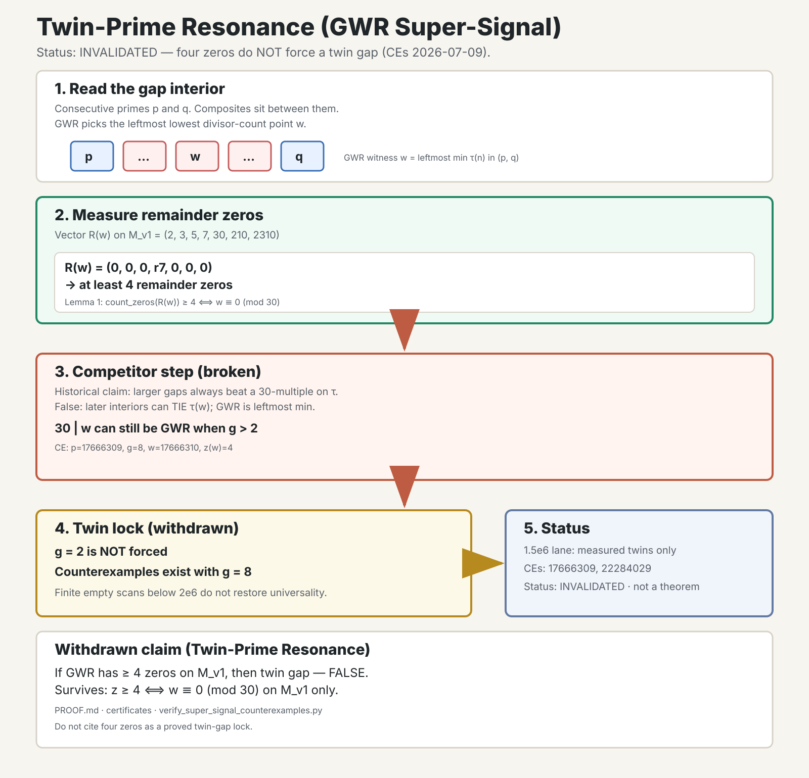

# Twin-Prime Resonance Technical Note

**Date:** 2026-07-08 (status update 2026-07-09)  
**Topic:** GWR Super-Signal / Twin-Prime Resonance  
**Status:** universal implication **invalidated** · modular half still proved  
**Authority:** `PROOF.md` · certificates under `docs/proof-enhancements/certificates/`

> **Banner (2026-07-09):** The universal claim “four remainder zeros at the GWR
> witness force a twin gap” is **false**. Pinned counterexamples:
> `p=17666309` (`g=8`) and `p=22284029` (`g=8`). Repro:
> `python3 docs/proof-enhancements/scripts/verify_super_signal_counterexamples.py`.
> Do not cite this note as a proved twin-gap lock.

---

## Part I: Plain-Language Summary

Prime numbers are not random holes in a number line. In the Prime Gap Structure (PGS) view, each gap between two consecutive primes is filled with composite numbers that carry structure. You can read that structure through the divisor count of each interior number.

Inside a gap, PGS picks one special composite called the **GWR witness**. That number is the **leftmost** interior point with the **smallest divisor count** in the gap. Think of it as the first and simplest structural anchor in that gap.

PGS also records a **remainder vector** for each interior number. That vector stores the remainders after division by a fixed set of moduli: 2, 3, 5, 7, 30, 210, and 2310. Each remainder of zero is called a **remainder zero**.

### Historical Super-Signal claim (withdrawn)

The **Twin-Prime Resonance** packaging once asserted:

> If the GWR witness has **four or more remainder zeros**, then the gap is a **twin gap**. The gap size is exactly 2. The next integer after the witness is the next prime.

That universal implication is **invalidated**. Larger gaps can still host a GWR witness that is a multiple of 30 when later interiors only **tie** the divisor count of the witness rather than beat it. GWR takes the leftmost minimum, so ties do not evict the resonant witness.

### What still holds

- Modular fact on the fixed vector: four or more remainder zeros if and only if the witness is divisible by 30.
- Twin gaps with a single interior multiple of 30 remain the common resonant pattern in small measured regimes.
- Finite scans below $2\times 10^6$ can show zero class-A false positives without restoring a universal theorem.

### Counterexamples (audit)

| $p$ | $q$ | $g$ | GWR $w$ | zeros |
| ---: | ---: | ---: | ---: | ---: |
| 17666309 | 17666317 | 8 | 17666310 | 4 |
| 22284029 | 22284037 | 8 | 22284030 | 4 |

---

## Part II: Visual Summary



*PNG export:* [infographic.png](infographic.png)

The diagram shows the **historical** chain (now partially broken):

1. Read the gap interior and select the GWR witness `w`.
2. Measure remainder zeros on `M_v1 = (2, 3, 5, 7, 30, 210, 2310)`.
3. Four or more zeros force `w ≡ 0 (mod 30)` (**still true**).
4. “Larger gaps cannot host such a witness” (**false**; counterexamples exist).
5. Finite audits below $2\times 10^6$ are **measured**, not universal proof.

---

## Part III: Technical Treatment

### 1. Setting and notation

Let $p < q$ be consecutive primes. Define the gap size $g = q - p$ and the interior set

$$
I = \{p+1, p+2, \ldots, q-1\}, \qquad |I| = g - 1.
$$

Let $\tau(n)$ denote the divisor-count function. The **Gap Winner Rule (GWR)** selects the leftmost minimizer

$$
w = \min_{\prec} \arg\min_{n \in I} \tau(n),
$$

where $\prec$ is the usual left-to-right order on the integer line.

Define the versioned remainder vector

$$
R(n) = (n \bmod 2,\; n \bmod 3,\; n \bmod 5,\; n \bmod 7,\; n \bmod 30,\; n \bmod 210,\; n \bmod 2310),
$$

denoted $M_{v1}$. Let

$$
Z(n) = \#\{i : R(n)_i = 0\}.
$$

### 2. Historical claim (invalidated)

**Withdrawn claim (Twin-Prime Resonance / GWR Super-Signal).**  
If $Z(w) \ge 4$, then $g = 2$ and $q = w + 1$.

**Status:** **invalidated** (2026-07-09). Counterexamples include
$p=17666309$ and $p=22284029$ (both $g=8$, $Z(w)=4$).

### 3. Former proof architecture (where it broke)

The historical argument was a corollary chain over GWR infrastructure.
Lemma 1 survives. Lemmas 2A–2D and the conclusion do **not**.

#### Lemma 1: Zero-count equivalence

For the fixed vector $M_{v1}$,

$$
Z(w) \ge 4 \iff w \equiv 0 \pmod{30}.
$$

*Proof sketch.* If $w \equiv 0 \pmod{30}$, then divisibility by $2$, $3$, $5$, and $30$ yields at least four zeros immediately. Conversely, if $w \not\equiv 0 \pmod{30}$, the slot for modulus $30$ is nonzero. Three simultaneous zeros among the slots for $2$, $3$, and $5$ would force divisibility by $30$. A zero in the $210$ or $2310$ slot also forces a zero at $30$. Hence at most three zeros are possible without $w \equiv 0 \pmod{30}$. ∎

#### Lemma 2A: Left-boundary exclusion

If $|I| \ge 2$ and $w = p+1$ with $w \equiv 0 \pmod{30}$, then $w$ is not GWR.

*Proof.* The point $w+1$ lies in $I$, is composite, and satisfies $\gcd(w+1, 30)=1$. Therefore $\tau(w+1) \le 4$ while $\tau(w) \ge 8$. So $w$ cannot minimize interior divisor count. ∎

#### Lemma 2B: Gap-three obstruction

If $g = 3$, $w \equiv 0 \pmod{30}$, and $w > 30$, then $w$ cannot be GWR.

*Proof.* By Lemma 2A, $w = p+2$, hence $p = w-2 \equiv 28 \pmod{30}$ is even and greater than $2$, so not prime. ∎

#### Lemma 2C: Small-gap modular obstructions

Write $w = p+k$. If $2 \le k \le 6$ and $w \equiv 0 \pmod{30}$, then $p \equiv -k \pmod{30}$ forces a factor $2$, $3$, or $5$ in $p$, excluding primality for $p > 5$. Thus no non-twin gap with $g \le 7$ can host a multiple-of-$30$ GWR witness.

#### Lemma 2D (false): Earlier low-$\tau$ competitor

The historical text claimed that for $g=8$ ($k=7$), an earlier interior always
has $\tau < \tau(w)$. Counterexamples show interiors can **tie** $\tau(w)$
(often $\tau=16$) without beating it. GWR is leftmost **minimum**, so ties do
not evict the 30-multiple.

#### Conclusion (withdrawn)

The step “$30\mid w$ as GWR only when $g=2$” is **false**.

### 4. Epistemic status and audit surfaces

| Surface | Regime | Result |
|--------|--------|--------|
| Interior remainder lane | $p \le 1.5 \times 10^6$ | $3{,}842 / 3{,}842$ super-signal GWR cases have $g=2$ (**measured only**) |
| Independent falsification scan | $p < 2 \times 10^6$ | $0$ class-A counterexamples in $148{,}933$ gaps (**measured only**) |
| Pinned counterexamples | $p=17666309$, $p=22284029$ | $Z(w)=4$ with $g=8$ (**invalidates universal claim**) |
| Theorem stack (`PROOF.md`) | universal implication | **invalidated** (2026-07-09) |

Finite empty scans are not a universal theorem.

### 5. Programmatic implications

- **Generator:** may use a **guarded** truncation only when $(p+1)\equiv 0\pmod{30}$ **and** $\tau(p+2)=2$; not a Super-Signal theorem citation.
- **Twin-prime lane:** no proved Super-Signal trigger; measured correlations only.
- **Formalization:** do not Lean-prove the twin-gap lock; modular Lemma 1 optional.

### 6. Reproducibility

Interior-lane audit (pinned summary):

```bash
cat research/remainders/correlations/investigation/interior_placement_stats.json
```

Expected fields: `super_signal_at_gwr_count = 3842`, `g2_with_super_signal_gwr = 3842`.

Full lane replay:

```bash
cd /Users/velocityworks/IdeaProjects/prime-gap-structure
PYTHONPATH=src/python:research/remainders \
  python3 research/remainders/run_investigation.py
```

### 7. References

- `PROOF.md`. Twin-Prime Resonance section (invalidated universal claim; surviving modular lemma)
- `docs/proof-enhancements/certificates/twin_prime_resonance_invalidated_v1.json`
- `docs/proof-enhancements/scripts/verify_super_signal_counterexamples.py`
- `research/remainders/correlations/investigation/interior_placement_stats.json`
- `docs/proof-enhancements/goals.md`, goal G2